<!-- badges: start -->
[](https://github.com/EvolEcolGroup/geograph/actions/workflows/R-CMD-check.yaml)
<!-- badges: end -->


*geoGraph*: walking through the geographic space using graphs.
=================================================


This document describes the *geoGraph* package for the R software.
*geoGraph* aims at implementing graph approaches for geographic data.
In *geoGraph*, a given geographic area is modelled by a fine regular grid, where each vertice
has a set of spatial coordinates and a set of attributes, which can be for instance habitat
descriptors, or the presence/abundance of a given species.
'Travelling' within the geographic area can then be easily modelled as moving between connected vertices.
The cost of moving from one vertex to another can be defined according to attribute values, which
allows for instance to define friction routes based on habitat.


*geoGraph* harnesses the full power of graph algorithms implemented in R by the *graph*
and *RBGL* (R Boost Graph Library) packages.
In particular, RBGL is an interface between R and the comprehensive *Boost Graph Library* in C++,
which provides fast and efficient implementations of a wide range of graph algorithms.
Once we have defined frictions for an entire geographic area, we can easily, for instance, find the least
costs path from one location to another, or find the most parsimonious way of connecting a set of locations.


Interfacing spatial data and graphs can be a complicated task.
The purpose of *geoGraph* is to provide tools to achieve and simplify this 'preliminary' step.
This is achieved by defining new classes of objects which are essentially geo-referenced graphs
with node attributes (`gGraph` objects), and interfaced spatial data (`gData` objects).
In this vignette, we show how to install *geoGraph*, construct and handle
`gGraph`/`gData` objects, and illustrate some basic features of graph algorithms.


# First steps


## Installing the package

Installing *geoGraph*
-------------

All the following instructions should be entered from a new R session to avoid errors due to installing attached packages.

*devtools* is needed to install *geoGraph*:
```r
install.packages("devtools")
```


Then, to install *geoGraph*, simply type:
```r
devtools::install_github("thibautjombart/geoGraph")
```

Once installed, the package can be loaded using:

```r
library("geoGraph")
```

```
## Loading required package: graph
## Loading required package: RBGL
## Loading required package: sp
## 
##    /// geoGraph 1.0-0 is loaded ////////////
## 
##    > overview: '?geoGraph'
##    > tutorials/doc/questions: https://github.com/thibautjombart/geograph'
```


## Data representation

Data representation refers to the way a given type of data is handled by a computer program.
Two types of objects are used in *geoGraph*: `gGraph`, and `gData` objects.
Both objects are defined as formal (S4) classes and often have methods for similar generic function
(e.g. `getNodes` is defined for both objects).
Essentially, `gGraph` objects contain underlying layers of informations, including a spatial
grid and possibly node attributes, and covering the area of interest.
`gData` are sets of locations (like sampled sites, for instance) which have been interfaced
to a `gGraph` object, to allow further manipulations such as finding paths on the grid between
pairs of locations.


### gGraph objects

The definition of the formal class `gGraph` can be obtained using:

```r
getClass("gGraph")
```

```
## Class "gGraph" [package "geoGraph"]
## 
## Slots:
##                                                   
## Name:      coords nodes.attr       meta      graph
## Class:     matrix data.frame       list   graphNEL
```
and a new empty object can be obtained using the constructor:

```r
new("gGraph")
```

```
## 
## === gGraph object ===
## 
## @coords: spatial coordinates of 0 nodes
##      lon lat
## 
## @nodes.attr: 0 nodes attributes
## data frame with 0 columns and 0 rows
## 
## @meta: list of meta information with 0 items
## 
## @graph:
## A graphNEL graph with undirected edges
## Number of Nodes = 0 
## Number of Edges = 0
```

The documentation `?gGraph` explains the basics about the object's content.
In a nutshell, these objects are spatial grids with nodes and segments connecting neighbouring
nodes, and additional informations on the nodes or on the graph itself.
`coords` is a matrix of longitudes and latitudes of the nodes.
`nodes.attr` is a data.frame storing attributes of the nodes, such as habitat descriptors; each
row corresponds to a node of the grid, while each column corresponds to a variable.
`meta` is a list containing miscellanous informations about the graph itself.
There is no contraint applying to the components of the list, but some typical components such as
`$costs` or `$colors` will be recognised by certain functions.
For instance, you can specify plotting rules for representing a given node attribute by a given
color by defining a component `$colors`.
Similarly, you can associate costs to a given node attribute by defining a component `$costs`.
An example of this can be found in already existing `gGraph` objects.
For instance, `worldgraph.10k` is a graph of the world with approximately 10,000 nodes, and
only on-land connectivity (\textit{i.e.` no travelling on the seas).

```r
worldgraph.10k
```

```
## 
## === gGraph object ===
## 
## @coords: spatial coordinates of 10242 nodes
##       lon    lat
## 1 -180.00  90.00
## 2  144.00 -90.00
## 3  -33.78  27.19
## ...
## 
## @nodes.attr: 1 nodes attributes
##   habitat
## 1     sea
## 2     sea
## 3     sea
## ...
## 
## @meta: list of meta information with 2 items
## [1] "$colors" "$costs" 
## 
## @graph:
## A graphNEL graph with undirected edges
## Number of Nodes = 10242 
## Number of Edges = 6954
```

```r
worldgraph.10k@meta
```

```
## $colors
##            habitat       color
## 1              sea        blue
## 2             land       green
## 3         mountain       brown
## 4       landbridge light green
## 5 oceanic crossing  light blue
## 6  deselected land   lightgray
## 
## $costs
##            habitat cost
## 1              sea  100
## 2             land    1
## 3         mountain   10
## 4       landbridge    5
## 5 oceanic crossing   20
## 6  deselected land  100
```
Lastly, the `graph` component is a `graphNEL` object, which is the standard class for
graphs in the *graph* and *RBGL* packages.
This object contains all information on the connections between nodes, and the weights (costs) of
these connections.


Four main `gGraph` are provided with *geoGraph*: `rawgraph.10k`, `rawgraph.40k`,
`worldgraph.10k`, and `worldgraph.40k`.
These datasets are available using the command `data`.
The grid used in these datasets are the best geometric approximation of a regular grid for the surface of a sphere.
One advantage of working with these grids is that we do not have to use a projection for geographic
coordinates, which is a usual issue in regular GIS.

The difference between rawgraphs and worldgraphs is that the first are entirely connected, while in the
second connections occur only on land.
Numbers `10k' and `40k' indicate that the grids consist of roughly 10,000 and 40,000 nodes.
For illustrative purposes, we will often use the 10k grids, since they are less heavy to handle.
For most large-scale applications, the 40k versions should provide sufficient resolution.
New `gGraph` can be constructed using the constructor (`new(...)`), but this topic is not
documented in this vignette.


### gData objects

`gData` are essentially sets of locations that are interfaced with a `gGraph` object.
During this operation, each location is assigned to the closest node on the grid of the
`gGraph`, then allowing for travelling between locations using the grid.
Then, it is for instance possible to find the shortest path between two locations through various
types of habitats.


Like for `gGraph`, the content of the formal class `gData` can be obtained using:

```r
getClass("gData")
```

```
## Class "gData" [package "geoGraph"]
## 
## Slots:
##                                                       
## Name:       coords    nodes.id        data gGraph.name
## Class:      matrix   character         ANY   character
```
and a new empty object can be obtained using the constructor:

```r
new("gData")
```

```
## 
## === gData object ===
## 
## @coords: spatial coordinates of 0 nodes
##      lon lat
## 
## @nodes.id: nodes identifiers
## character(0)
## 
## @data: data
## NULL
## 
## Associated gGraph:
```
As before, the description of the content of these objects can be found in the documentation (`?gData`).
`coords` is a matrix of xy (longitude/latitude) coordinates in which each row is a location.
`nodes.id` is vector of characters giving the name of the vertices matching the locations; this is
defined automatically when creating a new `gData`, or using the function `closestNode`.
`data` is a slot storing data associated to the locations; it can be any type of object, but a data.frame
should cover most requirements for storing data.
Note that this object should be subsettable (i.e. the `[` operator should be defined), so that data can be subsetted when subsetting the `gData` object.
Lastly, the slot `gGraph.name` contains the name of the `gGraph` object to which the
`gData` has been interfaced.


Contrary to `gGraph` objects, `gData` objects will frequently be constructed by the user.
In the next sections, we illustrate how we can build and use `gData` objects from a set
of locations.


# Using *geoGraph*


An overview of the material implemented in the package is summarized the package's manpage, accessible
via:

```r
?geoGraph
```
The html version of this manpage may be preferred to browse more easily the content
of *geoGraph*; it is accessible by typing:

```r
help("geoGraph", package="geoGraph", html=TRUE)
```
To revert help back to text mode, simply type:

```r
options(htmlhelp = FALSE)
```

In the following, we go through various tasks that can be achieve using *geoGraph*.


## Importing geographic data

GeoGraphic data consist of a set of locations, possibly accompanied by additional information.
For instance, one may want to study the migrations amongst a set of biological populations with known
geographic coordinates.
In *geoGraph*, geographic data are stored in `gData` objects.
These objects match locations to the closest nodes on a grid (a `gGraph` object), and store
additional data if needed.


As a toy example, let us consider four locations: Bordeaux (France), London (UK), Malaga (Spain), and Zagreb (Croatia).
Since we will be working with a crude grid (10,000 nodes), locations need not be exact.
We enter the longitudes and latitudes (in this order, that is, xy coordinates) of these cities in
decimal degrees, as well as approximate population sizes:

```r
Bordeaux <- c(-1,45)
London <- c(0,51)
Malaga <- c(-4,37)
Zagreb <- c(16,46)
cities.dat <- rbind.data.frame(Bordeaux, London, Malaga, Zagreb)
colnames(cities.dat) <- c("lon","lat")
cities.dat$pop <- c(1e6, 13e6, 5e5, 1.2e6)
row.names(cities.dat) <- c("Bordeaux","London","Malaga","Zagreb")
cities.dat
```

```
##          lon lat     pop
## Bordeaux  -1  45 1.0e+06
## London     0  51 1.3e+07
## Malaga    -4  37 5.0e+05
## Zagreb    16  46 1.2e+06
```
We load a `gGraph` object which contains the grid that will support the data:

```r
worldgraph.10k
```

```
## 
## === gGraph object ===
## 
## @coords: spatial coordinates of 10242 nodes
##       lon    lat
## 1 -180.00  90.00
## 2  144.00 -90.00
## 3  -33.78  27.19
## ...
## 
## @nodes.attr: 1 nodes attributes
##   habitat
## 1     sea
## 2     sea
## 3     sea
## ...
## 
## @meta: list of meta information with 2 items
## [1] "$colors" "$costs" 
## 
## @graph:
## A graphNEL graph with undirected edges
## Number of Nodes = 10242 
## Number of Edges = 6954
```

```r
plot(worldgraph.10k)
```

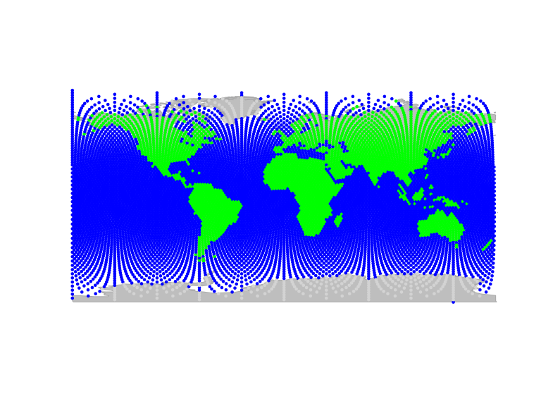 

 (we could use `worldgraph.40k` for a better resolution).
In this figure, each node is represented with a color depending on the habitat type, either 'sea'
(blue) or 'land' (green).
We are going to interface the cities data with this grid; to do so, we create a `gData` object using
`new` (see `?gData` object):

```r
cities <- new("gData", coords=cities.dat[,1:2], data=cities.dat[,3,drop=FALSE], gGraph.name="worldgraph.10k")
cities
```

```
## 
## === gData object ===
## 
## @coords: spatial coordinates of 4 nodes
##   lon lat
## 1  -1  45
## 2   0  51
## 3  -4  37
## ...
## 
## @nodes.id: nodes identifiers
##      1      2      3 
## "5774" "6413" "4815" 
## ...
## 
## @data: 4 data
##              pop
## Bordeaux 1.0e+06
## London   1.3e+07
## Malaga   5.0e+05
## ...
## 
## Associated gGraph: worldgraph.10k
```

```r
plot(cities, type="both", reset=TRUE)
plotEdges(worldgraph.10k)
```

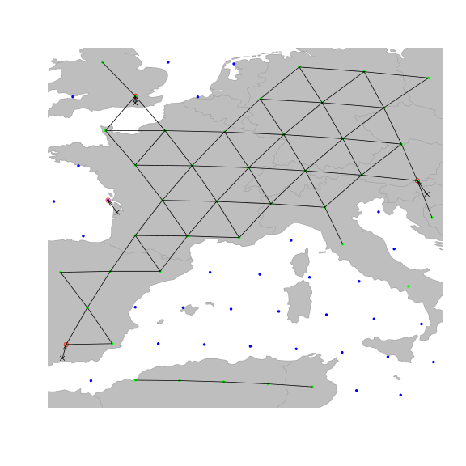 

 This figure illustrates the matching of original locations (black crosses) to nodes of the grid
(red circles).
As we can see, an issue occured for Bordeaux, which has been assigned to a node in the sea (in blue).
Locations can be re-assigned to nodes with restrictions for some node attribute values using
`closestNode`; for instance, here we constrain matching nodes to have an `habitat` value
(defined as node attribute in `worldgraph.10k`) equalling `land` (green points):

```r
cities <- closestNode(cities, attr.name="habitat", attr.value="land")
plot(cities, type="both", reset=TRUE)
plotEdges(worldgraph.10k)
```

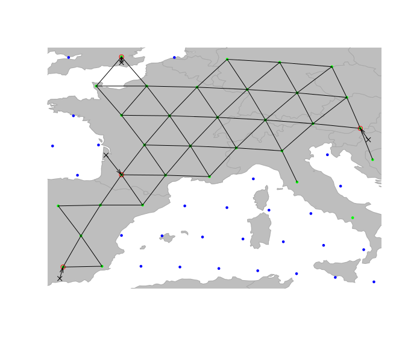 

 Now, all cities have been assigned to a `land' node of the grid (again, better accuracy will be
gained on 40k or finer grids - we use 10k for illustrative purposes only).
Content of `cities` can be accessed via various accessors (see `?gData`).
For instance, we can retrieve original locations, assigned nodes, and stored data using:

```r
getCoords(cities)
```

```
##      lon lat
## 5775  -1  45
## 6413   0  51
## 4815  -4  37
## 7699  16  46
```

```r
getNodes(cities)
```

```
##   5774   6413   4815   7699 
## "5775" "6413" "4815" "7699"
```

```r
getData(cities)
```

```
##              pop
## Bordeaux 1.0e+06
## London   1.3e+07
## Malaga   5.0e+05
## Zagreb   1.2e+06
```
We can also get the coordinates of the matching nodes (\textit{i.e.}, red circle on previous figure) using:

```r
getCoords(cities, original=FALSE)
```

```
##             lon   lat
## 5775  1.002e-05 43.73
## 6413  1.002e-05 51.38
## 4815 -3.788e+00 37.75
## 7699  1.548e+01 46.74
```
More interestingly, we can now retrieve all the geographic information contained in the underlying
grid (\textit{i.e.}, `gGraph` object) as node attributes:

```r
getNodesAttr(cities)
```

```
##      habitat
## 5775    land
## 6413    land
## 4815    land
## 7699    land
```
In this example, the information stored in `worldgraph.10k` is rather crude: `habitat` only
distinguishes the land from the sea.
However, more complex habitat information could be incorporated, for instance from GIS shapefiles
(see dedicated section below).


## Visualizing data

An essential aspect of spatial analysis lies in visualizing the data.
In *geoGraph*, the spatial grids (`gGraph`) and spatial data (`gData`) can be plotted
and browsed using a variety of functions.


### Plotting `gGraph` objects

Displaying a `gGraph` object is done through `plot` and `points` functions.
The first opens a new plotting region, while the second draws in the current plotting region;
functions have otherwise similar arguments (see `?plot.gGraph`).

By default, plotting a `gGraph` displays the grid of nodes overlaying a shapefile (by default,
the landmasses).
Edges can be plotted at the same time (argument `edges`), or added afterwards using `plotEdges`.
If the `gGraph` object possesses an adequately formed `meta$colors` component, the
colors of the nodes are chosen according to the node attributes and the color scheme specified in `meta$colors`.
Alternatively, the color of the nodes can be specified via the `col` argument in `plot`/`points`.

Here is an example using `worldgraph.10k`:

```r
worldgraph.10k@meta$colors
```

```
##            habitat       color
## 1              sea        blue
## 2             land       green
## 3         mountain       brown
## 4       landbridge light green
## 5 oceanic crossing  light blue
## 6  deselected land   lightgray
```

```r
head(getNodesAttr(worldgraph.10k))
```

```
##   habitat
## 1     sea
## 2     sea
## 3     sea
## 4     sea
## 5     sea
## 6     sea
```

```r
table(getNodesAttr(worldgraph.10k))
```

```
## 
## deselected land            land             sea 
##             290            2632            7320
```

```r
plot(worldgraph.10k, reset=TRUE)
title("Default plotting of worldgraph.10k")
```

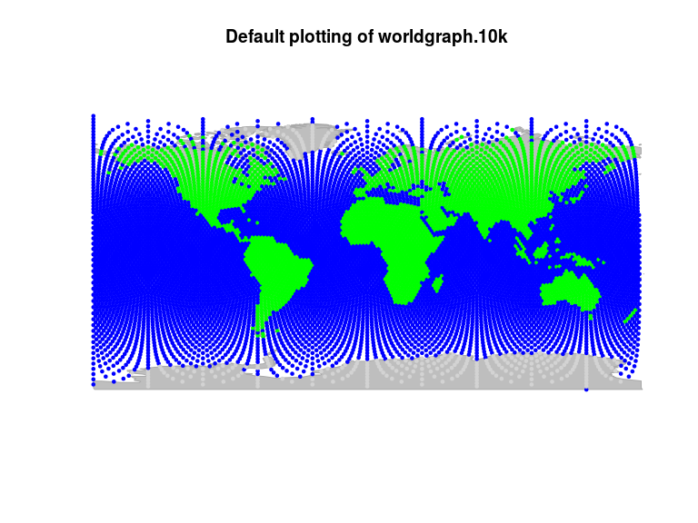 

 It may be worth noting that plotting `gGraph` objects involves plotting a fairly
large number of points and edges.
On some graphical devices, the resulting plotting can be slow.
For instance, one may want to disable `cairo` under linux: this graphical device yields better
graphics than `Xlib`, but at the expense of increase computational time.
To switch to `Xlib`, type:

```r
X11.options(type="Xlib")
```
and to revert to `cairo`, type:

```r
X11.options(type="cairo")
```


### Zooming in and out, sliding, etc.

In practice, it is often useful to be able to peer at specific regions, and more generally to
navigate inside the graphical representation of the data.
For this, we can use the interactive functions `geo.zoomin`, `geo.zoomout`, `geo.slide`,
`geo.back`, `geo.bookmark`, and `geo.goto`.
The zoom and slide functions require to left-click on the graphics to zoom in, zoom out, or slide to
adjacent areas; in all cases, a right click ends the function.
Also note that `geo.zoomin` can accept an argument specifying a rectangular region, which will
be adapted by the function to fit best a square area with similar position and centre, and zoom to
this area (see `?geo.zoomin`).
`geo.bookmark` and `geo.goto` respectively set and go to a bookmark, *i.e.* a tagged area.
This is most useful when one has to switch between distant areas repeatedly.


Here are some examples based on the previous plotting of `worldgraph.10k`:
Zooming in:

```r
geo.zoomin()
```
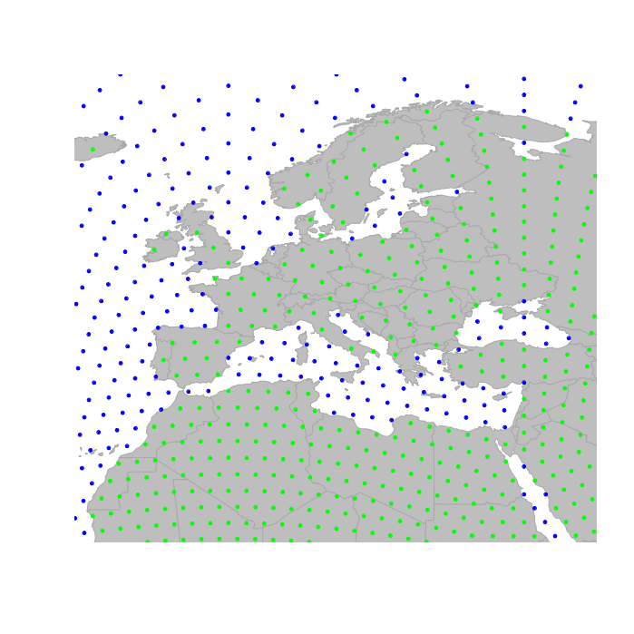

 Zooming out:

```r
geo.zoomout()
```
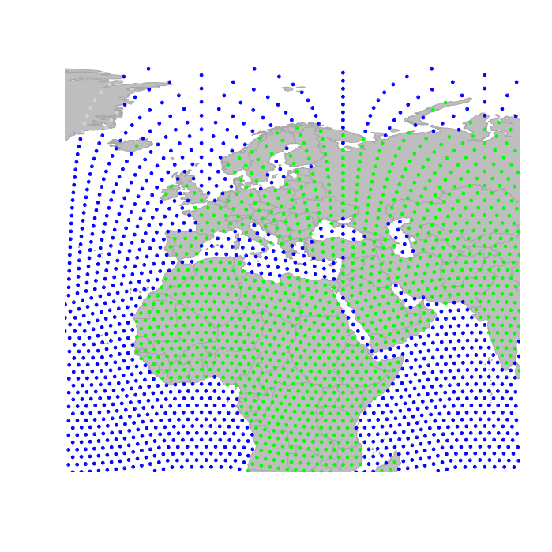

 Sliding to the east:

```r
geo.slide()
```
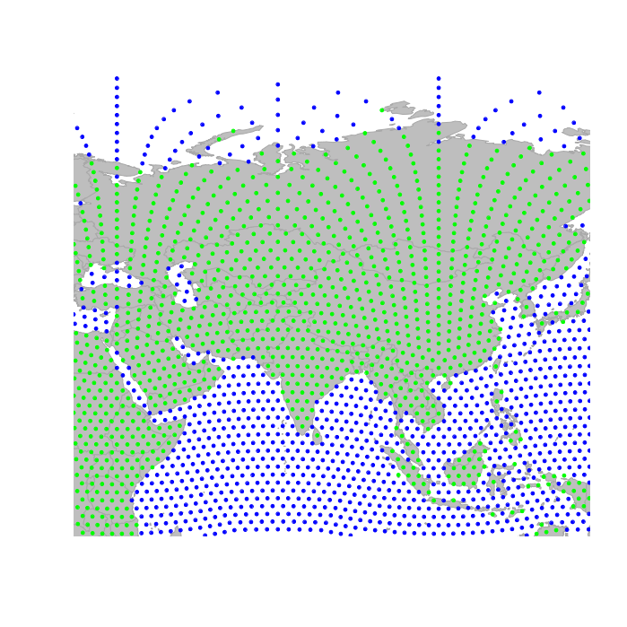


One important thing which makes plotting `gGraph` objects different from most other plotting in
R is that `geoGraph` keeps the changes made to the plotting area in memory.
This allows to undo one or several moves using `geo.back`.
Moreover, even if the graphical device is killed, plotting again a `gGraph` will use the old
parameters by default.
To disable this behavior, set the argument `reset=TRUE` when calling upon `plot`.
Technically, this 'plotting memory' is implemented by storing plotting information in an environment
defined as the hidden variable `.geoGraphEnv`:

```r
.geoGraphEnv
```

```
## <environment: 0x6981740>
```

```r
ls(env=.geoGraphEnv)
```

```
## [1] "bookmarks"       "last.plot"       "last.plot.param" "last.points"    
## [5] "psize"           "sticky.points"   "usr"             "zoom.log"
```

```r
get("last.plot", .geoGraphEnv)
```

```
## plot(worldgraph.10k, reset = TRUE)
```
It is recommended not to modify these objects directly, unless you really know what you are doing.
In any case, plotting a `gGraph` object with argument `reset=TRUE` will remove previous
plotting history and undo possible wrong manipulations.


### Plotting `gData` objects

`gData` objects are by default plotted overlaying the corresponding `gGraph`.
For instance, using the `cities` example from above:

```r
plot(cities, reset=TRUE)
text(getCoords(cities), rownames(getData(cities)))
```

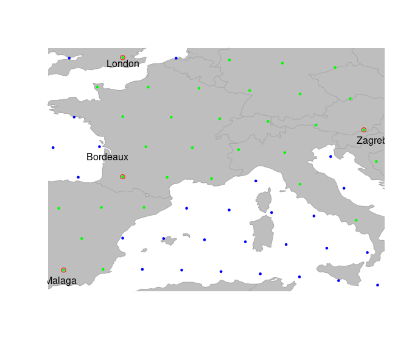 

 Note the argument `reset=TRUE`, which tells the plotting function to adapt the
plotting area to the geographic extent of the dataset.


To plot additional information, it can be useful to extract the spatial coordinates from the data.
This is achieved by `getCoords`.
This method takes an extra argument `original`, which is TRUE if original spatial coordinates
are seeked, or FALSE for coordinates of the nodes on the grid.
We can use this to represent, for instance, the population sizes for the different cities:

```r
transp <- function(col, alpha=.5){
    res <- apply(col2rgb(col),2, function(c) rgb(c[1]/255, c[2]/255, c[3]/255, alpha))
    return(res)
}


plot(cities, reset=TRUE)
par(xpd=TRUE)
text(getCoords(cities)+-.5, rownames(getData(cities)))
symbols(getCoords(cities)[,1], getCoords(cities)[,2], circ=sqrt(unlist(getData(cities))), inch=.2, bg=transp("red"), add=TRUE)
```

 


## Editing `gGraphs`

Editing graphs is an essential task in *geoGraph*.
While available `gGraph` objects provide a basis to work with (see `?worldgraph.10k`),
one may want to adapt a graph to a specific case.
For instance, connectivity should be defined according to biological knowledge of the organism under study.
`gGraph` can be modified in different ways: by changing the connectivity, the costs of
edges, or the attribute values.


### Changing the global connectivity of a `gGraph`


There are two main ways of changing the connectivity of a `gGraph`, which match two different objectives.
The first approach is to perform global and systematic changes of the connectivity of the graph.
Typically, one will want to remove all connections over a given type of landscape, which is
uncrossable by the organism under study.
Let's assume we are interested in saltwater fishes.
To model fish dispersal, we have to define a graph which connects only nodes overlaying the sea.
We load the `gGraph` object `rawgraph.10k`, and zoom in to a smaller area (Madagascar) to illustrate
changes in connectivity:

```r
geo.zoomin(c(35,54,-26,-10))
plotEdges(rawgraph.10k)
```

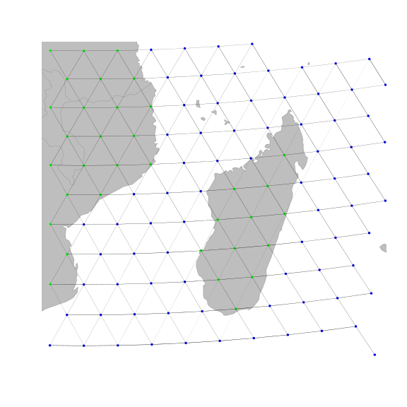 

 We shall set a bookmark for this area, in case we would want to get back to this place
later on:

```r
geo.bookmark("madagascar")
```

```
## 
## Bookmark ' madagascar  'saved.
```
What we now want to do is remove all but sea-sea connections.
To do so, the easiest approach is to i) define costs for the edges based on habitat, with land being
given large costs and ii) remove all edges with large costs.


Costs of a given node attribute (here, `habitat') are indicated in the `meta$costs` slot:

```r
rawgraph.10k@meta$costs
```

```
##            habitat cost
## 1              sea  100
## 2             land    1
## 3         mountain   10
## 4       landbridge    5
## 5 oceanic crossing   20
## 6  deselected land  100
```

```r
newGraph <- rawgraph.10k
newGraph@meta$costs[2:6,2] <- 100
newGraph@meta$costs[1,2] <- 1
newGraph@meta$costs
```

```
##            habitat cost
## 1              sea    1
## 2             land  100
## 3         mountain  100
## 4       landbridge  100
## 5 oceanic crossing  100
## 6  deselected land  100
```
We have just changed the costs associated to habitat type, but this change is not yet effective on
edges between nodes.
We use `setCosts` to set the cost of an edge to the average of the costs of its nodes:

```r
newGraph <- setCosts(newGraph, attr.name="habitat")
plot(newGraph,edge=TRUE)
```

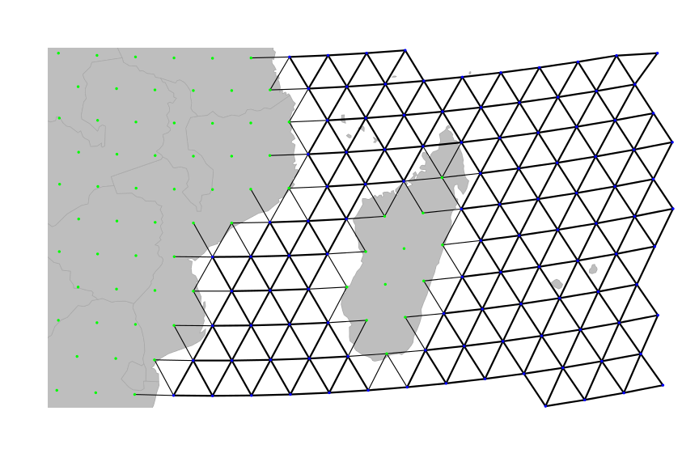 

On this new graph, we represent the edges with a width inversely proportional to the associated
cost; that is, bold lines for easy travelling and light edges/dotted lines for more costly mouvement.
This is not enough yet, since travelling on land is still possible.
However, we can tell *geoGraph* to remove all edges associated to too strong a cost, as defined
by a given threshold (using `dropDeadEdges`).
Here, only sea-sea connections shall be retained, that is, edges with cost 1.

```r
newGraph <- dropDeadEdges(newGraph, thres=1.1)
plot(newGraph,edge=TRUE)
```

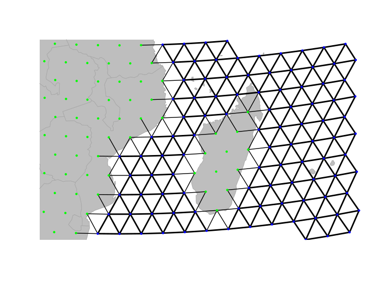 

Here we are: `newGraph` only contains connections in the sea.
Note that, although we restrained the plotting area to Madagascar, this change is effective everywhere.
For instance, travelling to the nort-west Australian coasts:

```r
geo.zoomin(c(110,130,-27,-12))
```

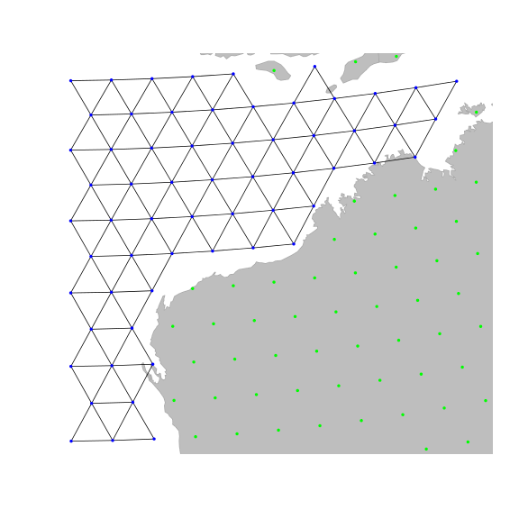 

```r
geo.bookmark("australia")
```

```
## 
## Bookmark ' australia  'saved.
```


### Changing local properties of a `gGraph`

A second approach to changing a `gGraph` is to refine the graph by hand, adding or removing
locally some connections, or altering the attributes of some nodes.
This can be necessary to connect components such as islands to the main landmasses, or to correct
erroneous data.
Adding and removing edges from the grid of a `gGraph` can be achieved by `geo.add.edges`
and `geo.remove.edges`, respectively.
These functions are interactive, and require the user to select individual nodes or a rectangular
area in which edges are added or removed.
See `?geo.add.edges` for more information on these functions.
For instance, we can remove a few odd connections in the previous graph, near the Australian coasts
(note that we have to save the changes using `<-`):

```r
geo.goto("autralia")
newGraph <- geo.remove.edges(newGraph)
```


 When adding connections within an area or in an entire graph, node addition is based on
another `gGraph`,*i.e.* only connections existing in another `gGraph` serving as
reference can be added to the current `gGraph`.
For graphs based on 10k or 40k grids, the raw graphs provided in `geoGraph` should be used,
(`rawgraph.10k`, `rawgraph.40k`), since they are fully connected.


In addition to changing grid connectivity, we may also want to modify the attributes of specific nodes.
This is again done interactively, using the function `geo.change.attr`.
For instance, here, we define a new value `shalowwater` (plotted in light blue) for the attribute `habitat`,
selecting affected nodes using the 'area' mode first, and refining the changes using the 'point' mode:

```r
plot(newGraph, edge=TRUE)
temp <- geo.change.attr(newGraph, mode="area", attr.name="habitat", attr.value="shallowwater", newCol="deepskyblue")
temp <- geo.change.attr(temp, attr.name="habitat", attr.value="shallowwater", newCol="deepskyblue")
newGraph <- temp
```

```r
newGraph@meta$colors
```

```
##            habitat       color
## 1              sea        blue
## 2             land       green
## 3         mountain       brown
## 4       landbridge light green
## 5 oceanic crossing  light blue
## 6  deselected land   lightgray
## 7     shallowwater deepskyblue
```

```r
plot(newGraph,edge=TRUE)
```

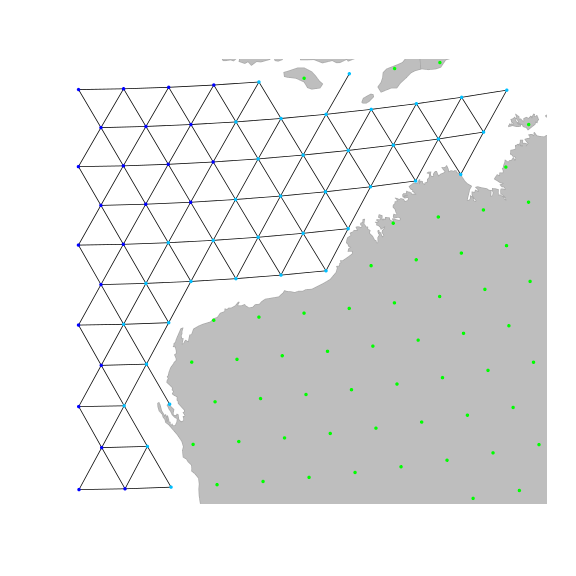 

Again, note that the changes made to the graph have to be save in an object (using `<-`) to be
effective.


## Extracting information from GIS shapefiles

An important feature of *geoGraph* is serving as an interface between *geographic information
system* (GIS) layers and geographic data.
As currently implemented, *geoGraph* can extract information from shapefiles with the Arc GIS
(http://www.esri.com/software/arcgis/index.html) format, using the function `extractFromLayer`.
Here, we illustrate this procedure using the shapefile `world-countries.shp` provided with the
package.
The GIS shapefile is first read in R using `readShapePoly` from the *maptools* package:

```r
library(maptools)
```

```
## Checking rgeos availability: FALSE
##  	Note: when rgeos is not available, polygon geometry 	computations in maptools depend on gpclib,
##  	which has a restricted licence. It is disabled by default;
##  	to enable gpclib, type gpclibPermit()
```

```r
world.countries <- readShapePoly(system.file("files/shapefiles/world-countries.shp",package="geoGraph"))
class(world.countries)
```

```
## [1] "SpatialPolygonsDataFrame"
## attr(,"package")
## [1] "sp"
```

```r
summary(world.countries)
```

```
## Object of class SpatialPolygonsDataFrame
## Coordinates:
##      min    max
## x -180.0 181.80
## y  -89.9  84.93
## Is projected: NA 
## proj4string : [NA]
## Data attributes:
##    WORCNTRY_I          ID                  NAME         ISO_2    
##  Min.   :  1.0   ABW    :  1   Afghanistan   :  1   AD     :  1  
##  1st Qu.: 60.5   AFG    :  1   Albania       :  1   AE     :  1  
##  Median :120.0   AGO    :  1   Algeria       :  1   AF     :  1  
##  Mean   :120.0   AIA    :  1   American Samoa:  1   AG     :  1  
##  3rd Qu.:179.5   ALB    :  1   Andorra       :  1   AI     :  1  
##  Max.   :239.0   AND    :  1   Angola        :  1   AL     :  1  
##                  (Other):233   (Other)       :233   (Other):233  
##     ISO_NUM         CAPITAL       POP_1994                CONTINENT 
##  10     :  1   N/A      :  2   Min.   :0.00e+00   Africa       :59  
##  100    :  1   Victoria :  2   1st Qu.:1.38e+05   Antarctica   : 2  
##  104    :  1   Abidjan  :  1   Median :3.58e+06   Asia         :73  
##  108    :  1   Abu Dhabi:  1   Mean   :2.24e+07   Australia    : 2  
##  112    :  1   Accra    :  1   3rd Qu.:1.12e+07   Europe       :51  
##  116    :  1   (Other)  :209   Max.   :1.18e+09   North America:34  
##  (Other):233   NA's     : 23                      South America:18
```
The summary of `world.countries` shows the data (attributes) stored in the layer.
Let us assume that we are interested in retrieving continent and country information for the
`worldgraph.10k` object.
Note that `extractFromLayer` can extract information to other types of objects than `gGraph` (see `?extractFromLayer`)

```r
summary(getNodesAttr(worldgraph.10k))
```

```
##             habitat    
##  deselected land: 290  
##  land           :2632  
##  sea            :7320
```

```r
newGraph <- extractFromLayer(worldgraph.10k,  layer=world.countries, attr=c("CONTINENT","NAME"))
summary(getNodesAttr(newGraph))
```

```
##             habitat             CONTINENT                    NAME     
##  deselected land: 290   Asia         : 957   Russian Federation: 339  
##  land           :2632   Africa       : 607   Antartica         : 241  
##  sea            :7320   North America: 430   United States     : 192  
##                         South America: 359   Canada            : 188  
##                         Antarctica   : 241   China             : 184  
##                         (Other)      : 325   (Other)           :1775  
##                         NA's         :7323   NA's              :7323
```
The new object `newGraph` is a `gGraph` which now includes, for each node of the grid, the
corresponding continent and country retrieved from the GIS layer.
We can use the newly acquired information for plotting `newGraph`, by defining new color rules:

```r
temp <- unique(getNodesAttr(newGraph)$"NAME")
col <- c("transparent", rainbow(length(temp)-1))
colMat <- data.frame(NAME=temp, color=col)
head(colMat)
```

```
##           NAME       color
## 1         <NA> transparent
## 2    Antartica   #FF0000FF
## 3 Saudi Arabia   #FF0B00FF
## 4        Yemen   #FF1500FF
## 5      Somalia   #FF2000FF
## 6        China   #FF2B00FF
```

```r
tail(colMat)
```

```
##           NAME     color
## 140     Latvia #FF0040FF
## 141    Belarus #FF0035FF
## 142    Eritrea #FF002AFF
## 143   Djibouti #FF0020FF
## 144 East Timor #FF0015FF
## 145     Jordan #FF000BFF
```

```r
plot(newGraph, col.rules=colMat, reset=TRUE)
```

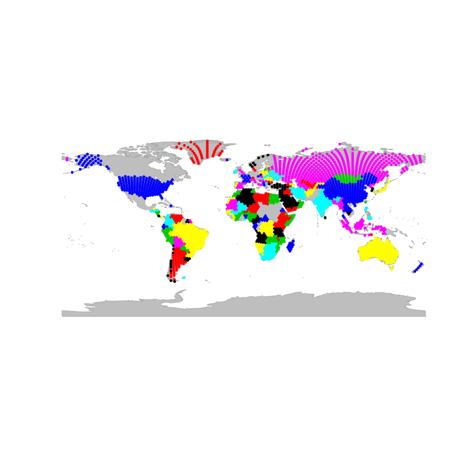 

 This information could in turn be used to define costs for travelling on the grid.
For instance, one could import habitat descriptors from a GIS, use these values to formulate a
habitat model, and derive costs for dispersal on the grid.


As soon as a GIS layer has been extracted to a `gGraph`, this information becomes also available for
any `gData` interfaced with this object.
For instance, we can re-use the `cities` example defined in a previous section, and interface it
with `newGraph` to retrieve continent and country information for the cities of the dataset:

```r
cities.dat
```

```
##          lon lat     pop
## Bordeaux  -1  45 1.0e+06
## London     0  51 1.3e+07
## Malaga    -4  37 5.0e+05
## Zagreb    16  46 1.2e+06
```

```r
cities <- new("gData", coords=cities.dat[,1:2], data=cities.dat[,3,drop=FALSE], gGraph.name="newGraph")
cities <- closestNode(cities, attr.name="habitat", attr.value="land")
getData(cities)
```

```
##              pop
## Bordeaux 1.0e+06
## London   1.3e+07
## Malaga   5.0e+05
## Zagreb   1.2e+06
```

```r
getNodesAttr(cities)
```

```
##      habitat CONTINENT                 NAME
## 5775    land    Europe France, Metropolitan
## 6413    land    Europe       United Kingdom
## 4815    land    Europe                Spain
## 7699    land    Europe              Austria
```


## Finding least-cost paths

One of the most useful applications of *geoGraph* is the research of least-cost paths between
couples of locations.
This can be achieved using the functions `dijkstraFrom` and `dijkstraBetween` on a
`gData` object which contains all the locations of interest.
These functions return least-cost paths with the format `gPath`.
`dijkstraFrom` compute the paths from a given node of the grid to all locations of the
`gData`, while `dijkstraBetween` computes the paths between pairs of locations of the
`gData`.
Below, we detail the example of the documentation of these functions, which uses the famous dataset of native
Human populations, HGDP:

```r
hgdp
```

```
## 
## === gData object ===
## 
## @coords: spatial coordinates of 52 nodes
##   lon lat
## 1  -3  59
## 2  39  44
## 3  40  61
## ...
## 
## @nodes.id: nodes identifiers
##   28179   11012   22532 
## "26898" "11652" "22532" 
## ...
## 
## @data: 52 data
##   Population Region Label  n Latitude Longitude Genetic.Div
## 1   Orcadian EUROPE     1 15       59        -3      0.7259
## 2     Adygei EUROPE     2 17       44        39      0.7298
## 3    Russian EUROPE     3 25       61        40      0.7320
## ...
## 
## Associated gGraph: worldgraph.40k
```

```r
plot(hgdp, reset=TRUE)
```

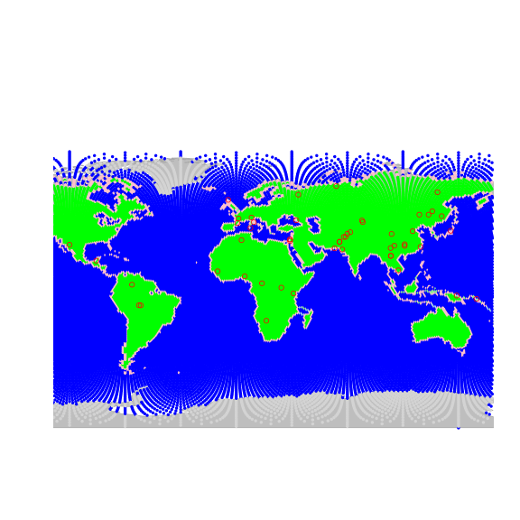 

 Populations of the dataset are shown by red circles, while the underlying grid
(`worldgraph.40k`) is represented with colors depending on habitat (blue: sea; green: land;
pink: coasts).
Population genetics predicts that genetic diversity within populations should decay as populations are
located further away from the geographic origin of the species.
Here, we verify this relationship for a theoretical origin in Addis abeba, Ethiopia.
We shall seek all paths through landmasses to the HGDP populations.


First, we check that all populations are connected on the grid using `isConnected`:

```r
isConnected(hgdp)
```

```
## [1] TRUE
```
Note that in practice, we may often want to assess graphically the connectivity of the underlying grid, especially
if not all locations of the `gData` are connected.
This can be done using `connectivityPlot`, which has methods for both `gGraph` and
`gData`, and represents different connected components using different colors.
For instance, for `worldgraph.10k`:

```r
connectivityPlot(worldgraph.10k, edges=TRUE, seed=1)
```

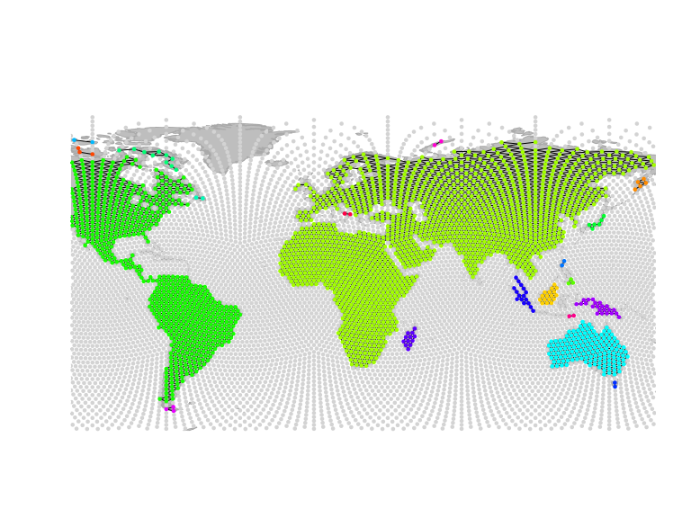 

```r
geo.zoomin(c(90,150,18,-25))
title("Different connected components\n in worldgraph.10k")
```

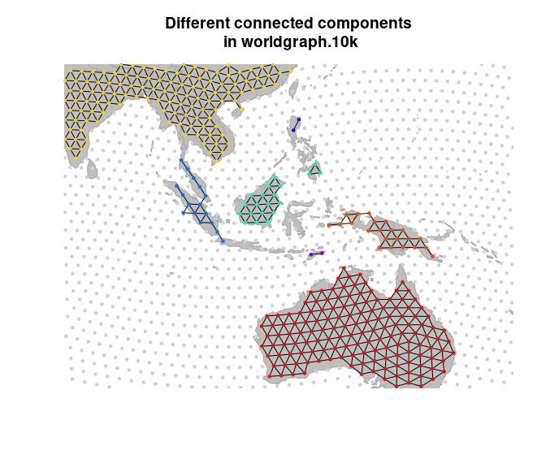 


Since all locations in `hgdp` are connected, we can proceed further.
We have to set the costs of edges in the `gGraph` grid.
To do so, we can choose between i) strictly uniform costs (using `dropCosts`) ii)
distance-based costs -- roughly uniform -- (using `setDistCosts`) or iii) attribute-driven
costs (using `setCosts`).


We shall first illustrate the strictly uniform costs.
After setting a `gGraph` with uniform costs, we use `dijkstraFrom` to find the shortest
paths between Addis abeba and the populations of `hgdp`:

```r
myGraph <- dropCosts(worldgraph.40k)
hgdp@gGraph.name <- "myGraph"
addis <- cbind(38,9)
ori <- closestNode(myGraph, addis)
paths <- dijkstraFrom(hgdp, ori)
```
The object `paths` contains the identified paths, which are stored as a list with class `gPath` (see `?gPath`).
Paths can be plotted easily:

```r
addis <- as.vector(addis)
plot(newGraph, col=NA, reset=TRUE)
plot(paths)
points(addis[1], addis[2], pch="x", cex=2)
text(addis[1]+35, addis[2], "Addis abeba", cex=.8, font=2)
points(hgdp, col.node="black")
```

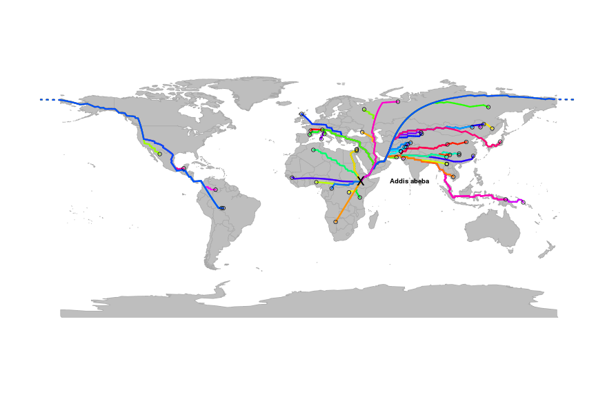 

In this graph, each path is plotted with a different color, but several paths overlap in several places.
We can extract the distances from the `origin' using `gPath2dist`, and then examine the
relationship between genetic diversity within populations (stored in `hgdp`) and the distance from the origin:

```r
div <- getData(hgdp)$"Genetic.Div"
dgeo.unif <- gPath2dist(paths, res.type="vector")
plot(div~dgeo.unif, xlab="GeoGraphic distance (arbitrary units)", ylab="Genetic diversity")
lm.unif <- lm(div~dgeo.unif)
abline(lm.unif, col="red")
summary(lm.unif)
```

```
## 
## Call:
## lm(formula = div ~ dgeo.unif)
## 
## Residuals:
##      Min       1Q   Median       3Q      Max 
## -0.07327 -0.00660  0.00074  0.01015  0.05449 
## 
## Coefficients:
##              Estimate Std. Error t value Pr(>|t|)    
## (Intercept)  7.70e-01   4.58e-03   168.2   <2e-16 ***
## dgeo.unif   -8.39e-04   5.31e-05   -15.8   <2e-16 ***
## ---
## Signif. codes:  0 '***' 0.001 '**' 0.01 '*' 0.05 '.' 0.1 ' ' 1
## 
## Residual standard error: 0.0185 on 50 degrees of freedom
## Multiple R-squared:  0.833,	Adjusted R-squared:  0.83 
## F-statistic:  250 on 1 and 50 DF,  p-value: <2e-16
```

```r
title("Genetic diversity vs geographic distance \n uniform costs ")
```

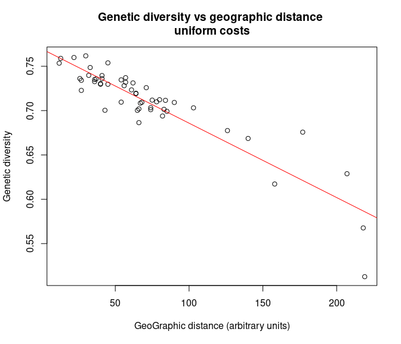 


Alternatively, we can use costs based on habitat.
As a toy example, we will consider that coasts are four times more favourable for dispersal than
the rest of the landmasses.
We define these new costs, and then compute and plot the corresponding shortest paths:

```r
myGraph@meta$costs[7,] <- c("coast", 0.25)
myGraph@meta$costs
```

```
##            habitat cost
## 1              sea  100
## 2             land    1
## 3         mountain   10
## 4       landbridge    5
## 5 oceanic crossing   20
## 6  deselected land  100
## 7            coast 0.25
```

```r
myGraph <- setCosts(myGraph, attr.name="habitat")
paths.2 <- dijkstraFrom(hgdp, ori)
```

```r
plot(newGraph, col=NA, reset=TRUE)
plot(paths.2)
points(addis[1], addis[2], pch="x", cex=2)
text(addis[1]+35, addis[2], "Addis abeba", cex=.8, font=2)
points(hgdp, col.node="black")
```

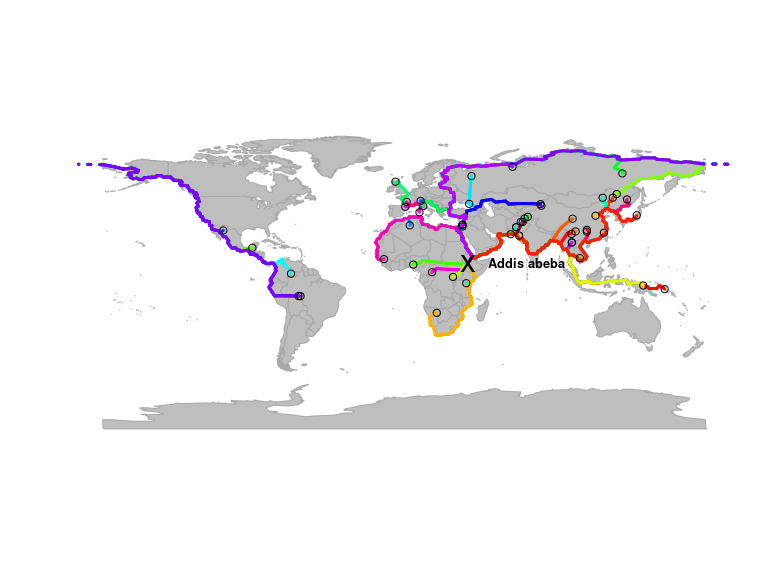 

The new paths are slightly different from the previous ones.
We can examine the new relationship with genetic distance:

```r
dgeo.hab <- gPath2dist(paths.2, res.type="vector")
plot(div~dgeo.hab, xlab="GeoGraphic distance (arbitrary units)", ylab="Genetic diversity")
lm.hab <- lm(div~dgeo.hab)
abline(lm.hab, col="red")
summary(lm.hab)
```

```
## 
## Call:
## lm(formula = div ~ dgeo.hab)
## 
## Residuals:
##      Min       1Q   Median       3Q      Max 
## -0.11183 -0.00976  0.00133  0.01216  0.06413 
## 
## Coefficients:
##              Estimate Std. Error t value Pr(>|t|)    
## (Intercept)  0.770137   0.007174  107.36  < 2e-16 ***
## dgeo.hab    -0.001421   0.000145   -9.79  3.2e-13 ***
## ---
## Signif. codes:  0 '***' 0.001 '**' 0.01 '*' 0.05 '.' 0.1 ' ' 1
## 
## Residual standard error: 0.0265 on 50 degrees of freedom
## Multiple R-squared:  0.657,	Adjusted R-squared:  0.651 
## F-statistic: 95.9 on 1 and 50 DF,  p-value: 3.21e-13
```

```r
title("Genetic diversity vs geographic distance \n habitat costs ")
```

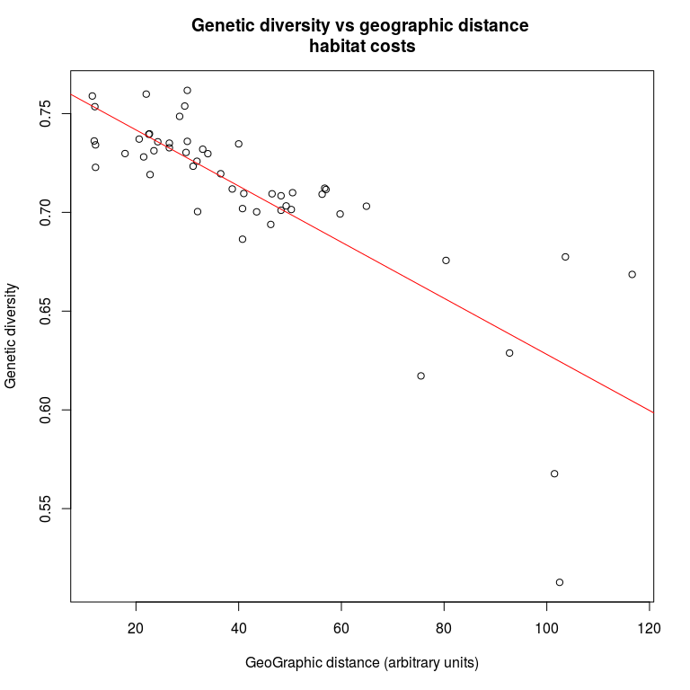 

Of course, the distinction between coasts and inner landmasses is a somewhat poor description of habitat.
In practice, complex habitat models can be used as simply.

