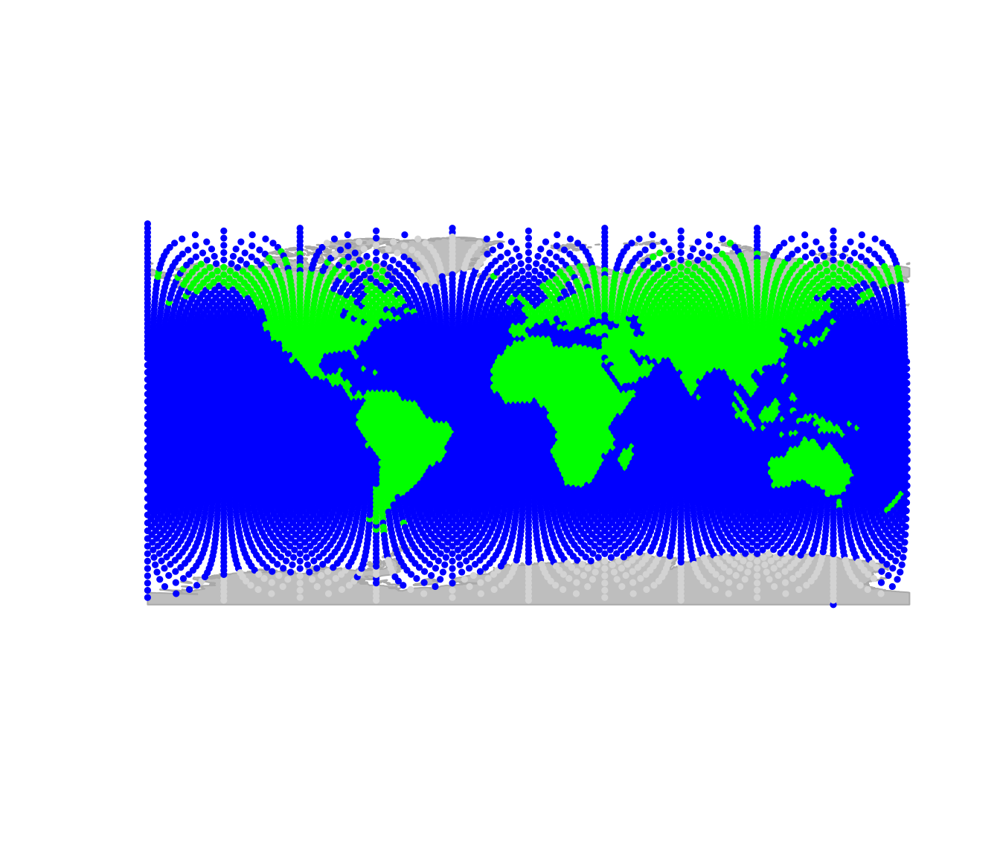
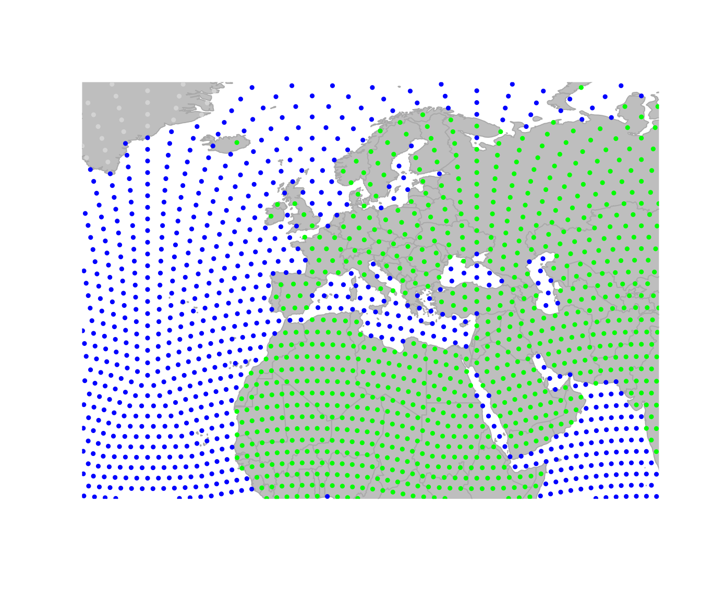
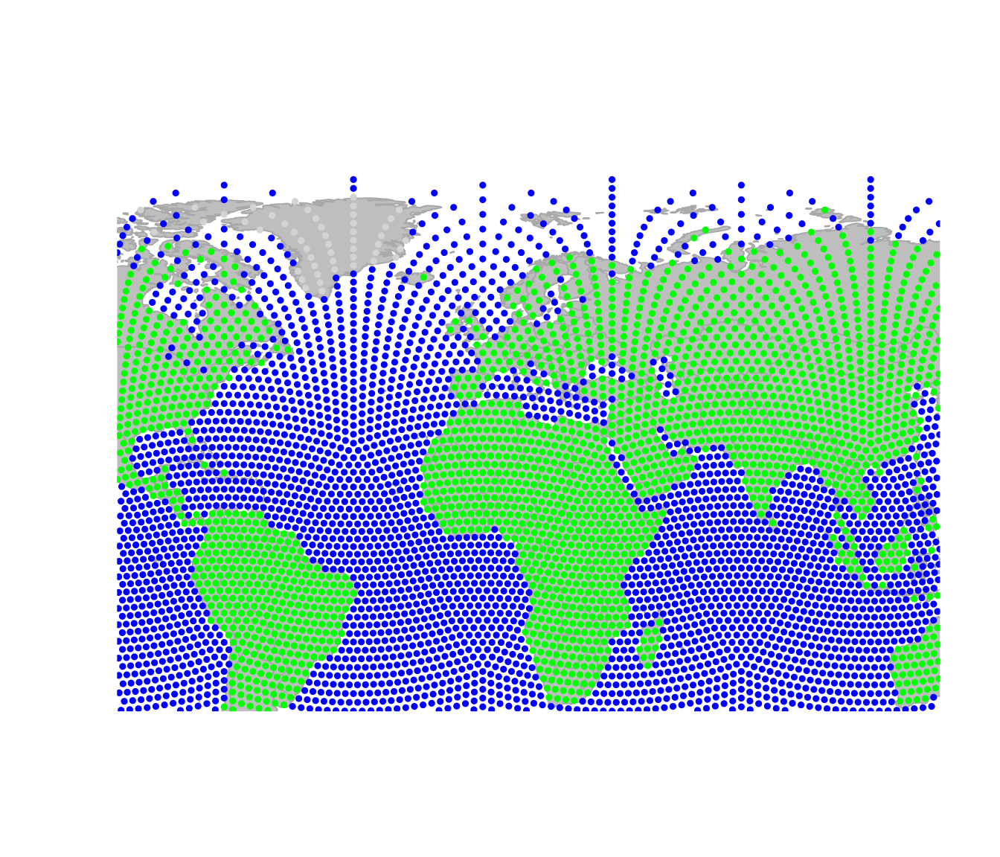
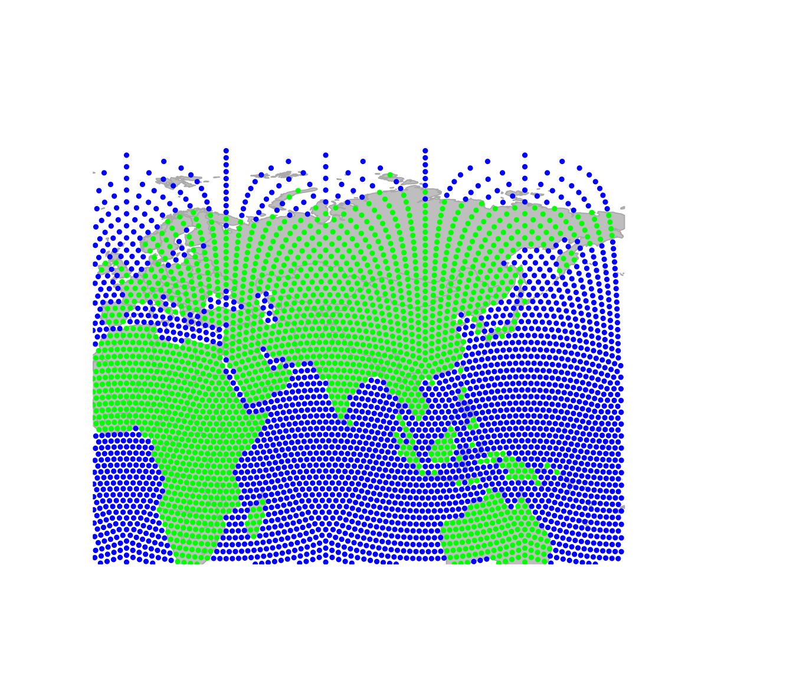
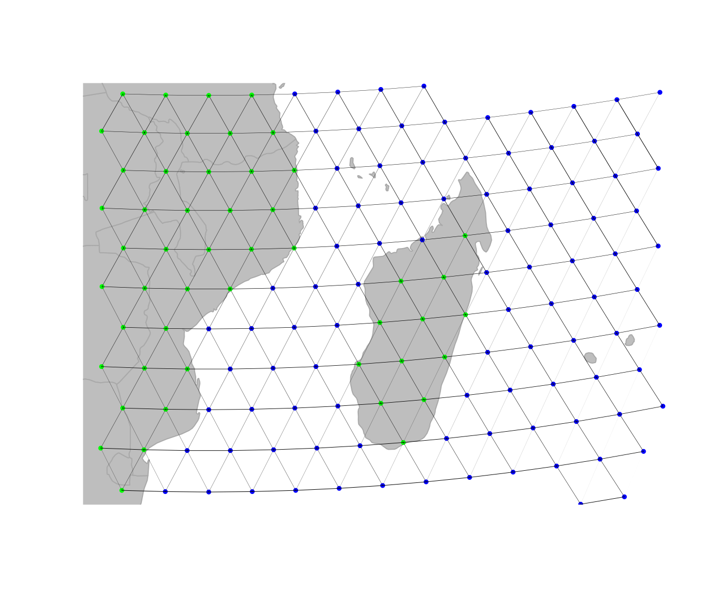
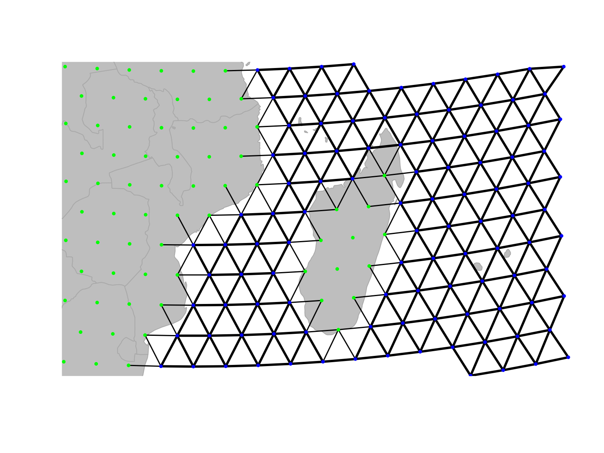
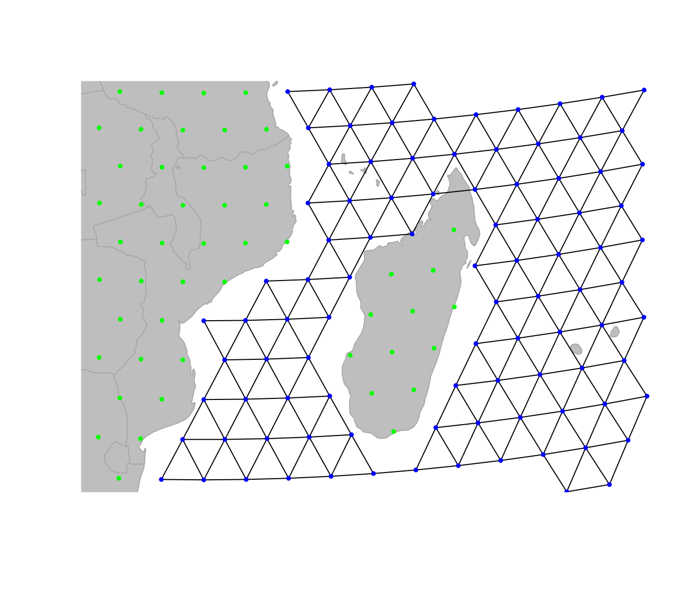
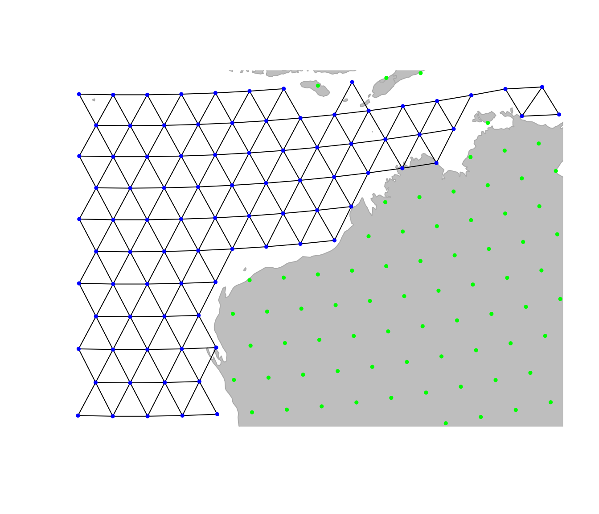
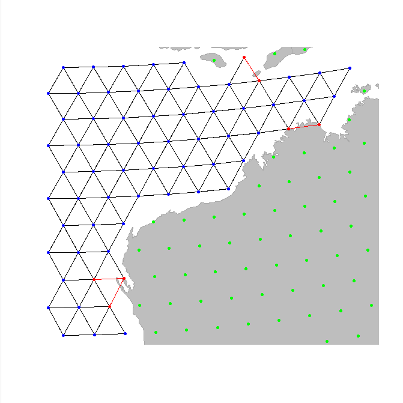
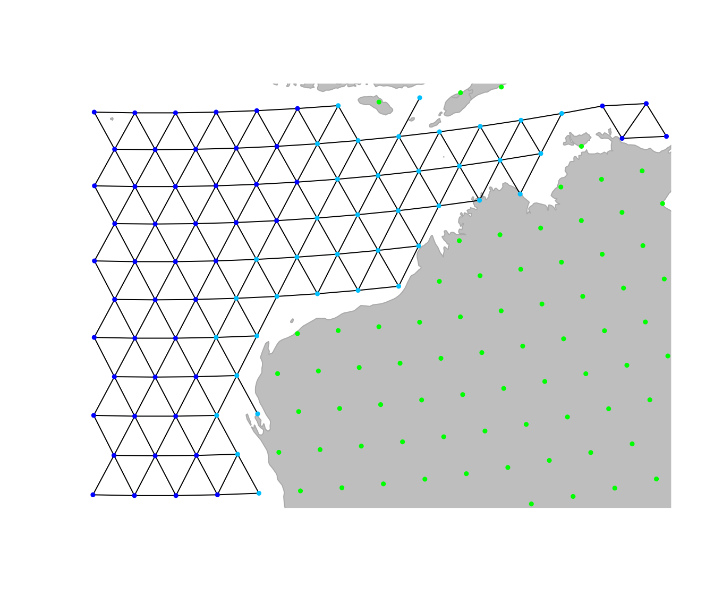

# Edit graphs in geoGraph

## Manually editing graphs in *geoGraph*

This vignette will cover the main functions for manually editing
`gGraph` objects. It also briefly touches on the way `geoGraph` keeps
track of the plotting area, and how to navigate within it as some of the
interactive functions rely on using the `locator.`

### Editing `gGraphs`

Editing graphs is an essential task in *geoGraph*. While available
`gGraph` objects provide a basis to work with (see
[`?worldgraph.10k`](https://evolecolgroup.github.io/geograph/reference/worldgraph.md)),
one may want to adapt a graph to a specific case. For instance,
connectivity should be defined according to biological knowledge of the
organism under study. `gGraph` can be modified in different ways: by
changing the connectivity, the costs of edges, or the attribute values.
We already saw in the vignette ‘get started’ how to manually add a
connection between two nodes, and we will see here how to change the
global connectivity and edge costs.

#### Visually inspecting a `gGraph` object

When customizing a `gGraph` object, it is often useful to be able to
peer at specific regions, and more generally to navigate inside the
graphical representation of the data. For this, we can use the
interactive functions `geo.zoomin`, `geo.zoomout`, `geo.slide`,
`geo.back`, `geo.bookmark`, and `geo.goto`. The zoom and slide functions
require to left-click on the graphics to zoom in, zoom out, or slide to
adjacent areas; in all cases, a right click ends the function. Also note
that `geo.zoomin` can accept an argument specifying a rectangular
region, which will be adapted by the function to fit best a square area
with similar position and center, and zoom to this area (see
[`?geo.zoomin`](https://evolecolgroup.github.io/geograph/reference/zoom.md)).
`geo.bookmark` and `geo.goto` respectively set and go to a bookmark,
*i.e.* a tagged area. This is most useful when one has to switch between
distant areas repeatedly.

Here are some examples based on the plotting of `worldgraph.10k`:
Zooming in:

``` r

plot(worldgraph.10k)
geo.zoomin()
```

    ## Spherical geometry (s2) switched off



    ## Spherical geometry (s2) switched on
    ## Spherical geometry (s2) switched off



    ## Spherical geometry (s2) switched on

Zooming out:

``` r

geo.zoomout()
```

    ## Spherical geometry (s2) switched off



    ## Spherical geometry (s2) switched on

Sliding to the east:

``` r

geo.slide()
```

    ## Spherical geometry (s2) switched off



    ## Spherical geometry (s2) switched on

One important thing which makes plotting `gGraph` objects different from
most other plotting in R is that `geoGraph` keeps the changes made to
the plotting area in memory. This allows to undo one or several moves
using `geo.back`. Moreover, even if the graphical device is killed,
plotting again a `gGraph` will use the old parameters by default. To
disable this behavior, set the argument `reset=TRUE` when calling upon
`plot`. Technically, this ‘plotting memory’ is implemented by storing
plotting information in an environment defined as the hidden environment
`geoGraph:::.geoGraphEnv`:

``` r

ls(env = geoGraph:::.geoGraphEnv)
```

    ## [1] "bookmarks"       "last.plot"       "last.plot.param" "last.points"    
    ## [5] "psize"           "sticky.points"   "usr"             "zoom.log"

You can inspect individual variables within this environment:

``` r

get("last.plot.param", envir = geoGraph:::.geoGraphEnv)
```

    ## $psize
    ## [1] 0.5
    ## 
    ## $pch
    ## [1] 19

However, it is recommended not to modify these objects directly, unless
you really know what you are doing. In any case, plotting a `gGraph`
object with argument `reset=TRUE` will remove previous plotting history
and undo possible wrong manipulations.

#### Changing the global connectivity of a `gGraph`

There are two main ways of changing the connectivity of a `gGraph`,
which match two different objectives. The first approach is to perform
global and systematic changes of the connectivity of the graph.
Typically, one will want to remove all connections over a given type of
landscape, which is impossible to cross by the organism under study.
Let’s assume we are interested in saltwater fishes. To model fish
dispersal, we have to define a graph which connects only nodes
overlaying the sea. We load the `gGraph` object `rawgraph.10k`, and zoom
in to a smaller area (Madagascar) to illustrate changes in connectivity:

``` r

geo.zoomin(c(35, 54, -26, -10))
```

    ## Spherical geometry (s2) switched off

    ## Spherical geometry (s2) switched on

``` r

plotEdges(rawgraph.10k)
```



We shall set a bookmark for this area, in case we would want to get back
to this place later on:

``` r

geo.bookmark("madagascar")
```

    ## 
    ## Bookmark ' madagascar  'saved.

What we now want to do is remove all but sea-sea connections. To do so,
the easiest approach is to i) define costs for the edges based on
habitat, with land being given large costs and ii) remove all edges with
large costs.

Costs of a given node attribute (here, habitat) can be retrieved using
getCosts(x, res.type = ‘rules’) and modified using setCosts with the
cost.rules argument.

``` r

getCosts(rawgraph.10k, res.type = "rules")
```

    ##            habitat cost
    ## 1              sea  100
    ## 2             land    1
    ## 3         mountain   10
    ## 4       landbridge    5
    ## 5 oceanic crossing   20
    ## 6  deselected land  100

``` r

cost.rules <- getCosts(rawgraph.10k, res.type = "rules")
cost.rules$cost[cost.rules$habitat == "sea"] <- 1
cost.rules$cost[cost.rules$habitat != "sea"] <- 100
newGraph <- setCosts(rawgraph.10k, attr.name = "habitat", cost.rules = cost.rules)
getCosts(newGraph, res.type = "rules")
```

    ##            habitat cost
    ## 1              sea    1
    ## 2             land  100
    ## 3         mountain  100
    ## 4       landbridge  100
    ## 5 oceanic crossing  100
    ## 6  deselected land  100

We have just changed the costs associated to habitat type, but this
change is not yet effective on edges between nodes. We use `setCosts` to
set the cost of an edge to the average of the costs of its nodes:

``` r

newGraph <- setCosts(newGraph, attr.name = "habitat")
plot(newGraph, edge = TRUE)
```

    ## Spherical geometry (s2) switched off



    ## Spherical geometry (s2) switched on

On this new graph, we represent the edges with a width inversely
proportional to the associated cost; that is, bold lines for easy
traveling and light edges/dotted lines for more costly movement. This is
not enough yet, since traveling on land is still possible. However, we
can tell *geoGraph* to remove all edges associated to too strong a cost,
as defined by a given threshold (using `dropDeadEdges`). Here, only
sea-sea connections shall be retained, that is, edges with cost 1.

``` r

newGraph <- dropDeadEdges(newGraph, thres = 1.1)
plot(newGraph, edge = TRUE)
```

    ## Spherical geometry (s2) switched off



    ## Spherical geometry (s2) switched on

Here we are: `newGraph` only contains connections in the sea. Note that,
although we restrained the plotting area to Madagascar, this change is
effective everywhere. For instance, traveling to the north-west
Australian coasts:

``` r

geo.zoomin(c(110, 130, -27, -12))
```

    ## Spherical geometry (s2) switched off



    ## Spherical geometry (s2) switched on

``` r

geo.bookmark("australia")
```

    ## 
    ## Bookmark ' australia  'saved.

#### Changing local properties of a `gGraph`

A second approach to changing a `gGraph` is to refine the graph by hand,
adding or removing locally some connections, or altering the attributes
of some nodes. This can be necessary to connect components such as
islands to the main landmasses, or to correct erroneous data. As seen in
the vignette ‘get started’, adding and removing edges from the grid of a
`gGraph` can be achieved by `geo.add.edges` and `geo.remove.edges`,
respectively. These functions are interactive, and require the user to
select individual nodes or a rectangular area in which edges are added
or removed. See
[`?geo.add.edges`](https://evolecolgroup.github.io/geograph/reference/geo.add.edges.md)
for more information on these functions. For instance, we can remove a
few odd connections in the previous graph, near the Australian coasts
(note that we have to save the changes using `<-`):

``` r

geo.goto("australia")
newGraph <- geo.remove.edges(newGraph)
```



img

When adding connections within an area or in an entire graph, node
addition is based on another `gGraph`, *i.e.* only connections existing
in another `gGraph` serving as reference can be added to the current
`gGraph`. For graphs based on 10k or 40k grids, the raw graphs provided
in `geoGraph` should be used, (`rawgraph.10k`, `rawgraph.40k`), since
they are fully connected.

In addition to changing grid connectivity, we may also want to modify
the attributes of specific nodes. This is again done interactively,
using the function `geo.change.attr`. For instance, here, we define a
new value `shallowwater` (plotted in light blue) for the attribute
`habitat`, selecting affected nodes using the ‘area’ mode first, and
refining the changes using the ‘point’ mode:

``` r

plot(newGraph, edge = TRUE)
newGraph <- geo.change.attr(newGraph,
  mode = "area", attr.name = "habitat",
  attr.value = "shallowwater", newCol = "deepskyblue"
)
newGraph <- geo.change.attr(newGraph,
  attr.name = "habitat",
  attr.value = "shallowwater", newCol = "deepskyblue"
)
```

``` r

getColors(newGraph, res.type = "rules")
```

    ##            habitat       color
    ## 1              sea        blue
    ## 2             land       green
    ## 3         mountain       brown
    ## 4       landbridge light green
    ## 5 oceanic crossing  light blue
    ## 6  deselected land   lightgray
    ## 7     shallowwater deepskyblue

``` r

plot(newGraph, edge = TRUE)
```

    ## Spherical geometry (s2) switched off



    ## Spherical geometry (s2) switched on

Again, note that the changes made to the graph have to be saved in an
object (using `<-`) to be effective.
