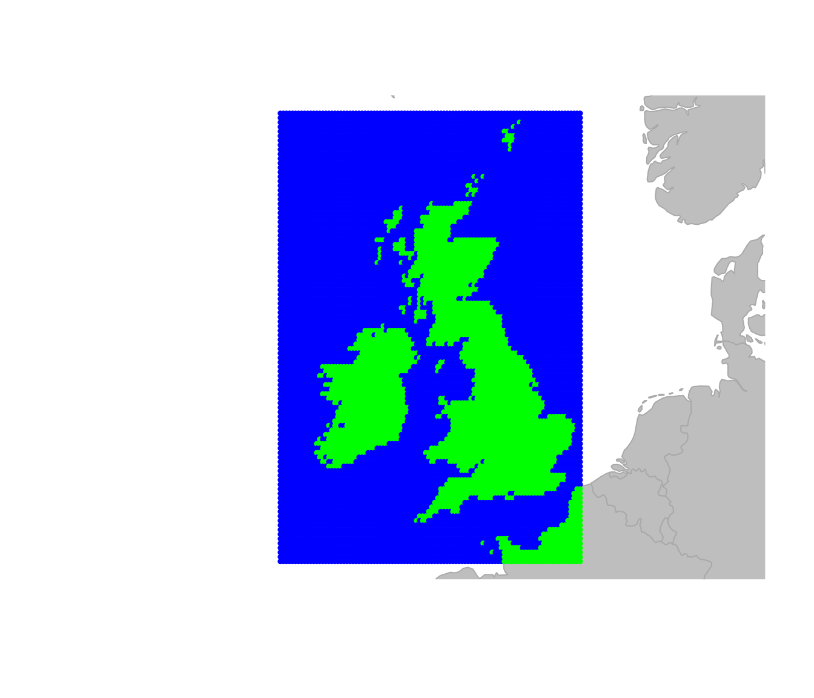
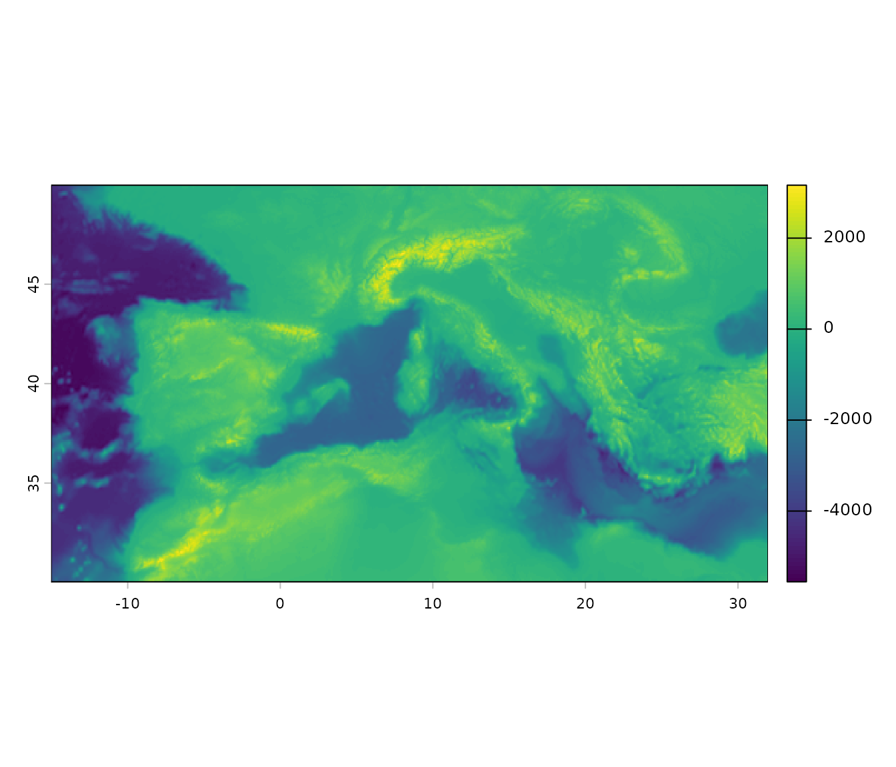
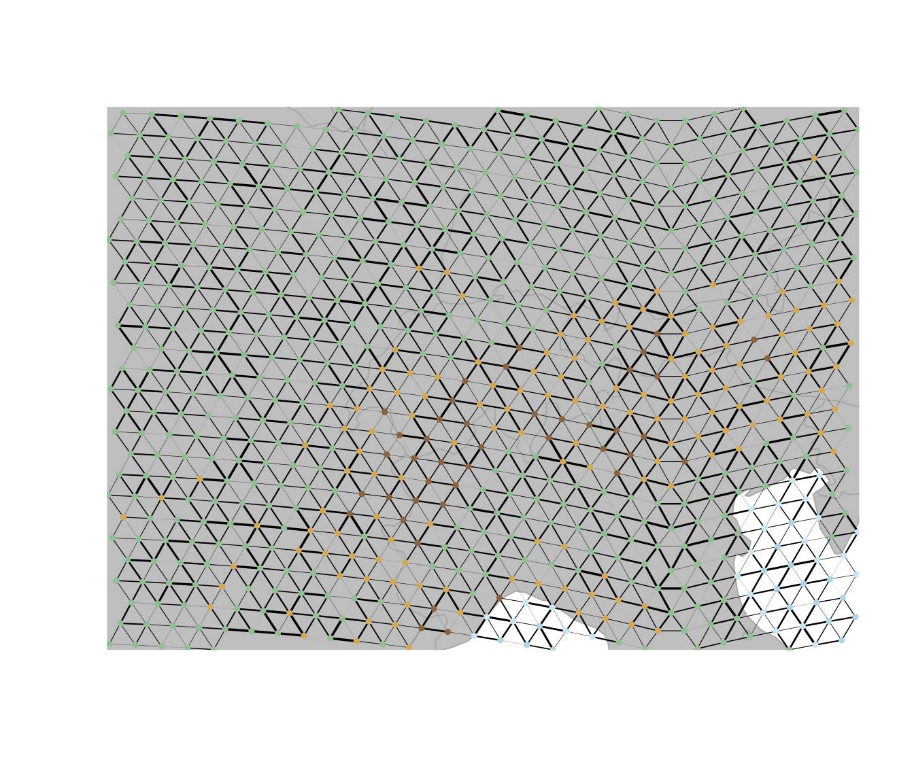
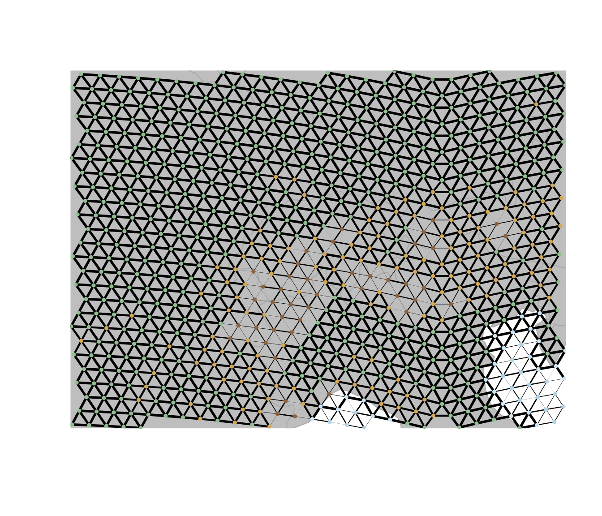

# Making custom grids in geoGraph

This vignette illustrates how to create custom `gGraph` objects in
*geoGraph* and how to assign environmental information to the nodes of
the graph. The `gGraph` objects can either be constructed using a square
grid or using a discrete global grid. The latter is especially useful
when working over larger areas of the world, where the square grid would
introduce messy distortions. Using the `dggridR` package, we can create
a custom hexagonal grids that provides a more accurate representation of
the Earth’s surface.

## Creating a custom square grid

We can create a custom square grid using the `makeSquareGrid` function.
This function allows us to specify the approximate number of the grid
cells and the geographic bounding box for the area of interest (by
setting the range for both the latitude and longitude of the grid) . In
this example, we create a grid with about 10’000 cells that covers the
area of Great Britain. We can then use the `findLand` function to
identify which cells in the grid correspond to land and which correspond
to sea, and we can visualize the resulting graph using the `plot`
function.

``` r

squareGraph <- makeSquareGrid(
  size      = 10000,
  lon.range = c(-12, 2),
  lat.range = c(49, 61)
)
squareGraph <- findLand(squareGraph)
colors <- data.frame(
  habitat = c("sea", "land"),
  color = c("#b0d4e8", "#90c090")
)

squareGraph <- setColors(squareGraph, colors)
plot(squareGraph, reset = TRUE)
```



## Creating a custom hexagonal grid

Now as mentioned above, using a square grid is fine for small scale
analyses but can introduce distortions when working over larger areas of
the world. To avoid this, we can use the `makeHexGrid` function to
create a hexagonal grid that provides a more accurate representation of
the Earth’s surface. In `makeHexGrid` we need to specify the geographic
bounding box for our area of interest and set the spacing between the
center of adjacent cells in kilometers. The function will then determine
an appropriate grid resolution based on this spacing. Be aware that
using a small spacing will result in a very large graph object, which
can be computationally intensive to work with. In this example, we
create a hexagonal grid with a spacing of about 30km that covers the
area of western Europe and parts of Northern Africa.

``` r

# define the area of interest (Europe)
area.of.interest <- st_as_sfc(
  st_bbox(c(
    xmin = -15,
    xmax = 32,
    ymin = 30,
    ymax = 50
  ), crs = 4326)
)

aoi.bound <- st_sf(geometry = area.of.interest)

hexGraph <- makeHexGrid(geo.box = aoi.bound, spacing = 30)
```

    ## Resolution: 10, Area (km^2): 863.800609195903, Spacing (km): 29.0273762609499, CLS (km): 33.1636203580006

``` r

hexGraph <- findLand(hexGraph)

colors <- data.frame(
  habitat = c("sea", "land"),
  color = c("#b0d4e8", "#90c090")
)

hexGraph <- setColors(hexGraph, colors)

plot(hexGraph, reset = TRUE)
```


We can get more information about the graph object we just created by
looking at the summary of the graph, which provides information about
the number of nodes and edges in the graph, as well as the already
existing attributes.

``` r

hexGraph
```

    ## 
    ## === gGraph object ===
    ## 
    ## @coords: spatial coordinates of 10465 nodes
    ##      lon   lat
    ## 1 -14.99 50.07
    ## 2 -14.60 50.07
    ## 3 -14.22 50.08
    ## ...
    ## 
    ## @nodes.attr: 1 nodes attributes
    ##   habitat
    ## 1     sea
    ## 2     sea
    ## 3     sea
    ## ...
    ## 
    ## @meta: list of meta information with 1 items
    ## [1] "$colors"
    ## 
    ## @graph:
    ## A graphNEL graph with undirected edges
    ## Number of Nodes = 10465 
    ## Number of Edges = 30976

### Setting costs for the different habitat types

Now we can also set the costs for moving through different habitat types
based on their classification. Note that the cost here is arbitrary and
can be adjusted based on the specific context of the analysis and the
species or features being studied. Costs are inversely related to the
ease of movement through a cell, so higher costs indicate more difficult
terrain. For example, we can assign a cost of 10 for moving through sea
cells and a cost of 1 for moving through land cells. If we now look at
the least cost path between two cities (Madrid and Naples) using the
`dijkstraBetween` function, we can see that the path tends to avoid sea
cells and prefers to move through land cells.

``` r

# set the costs for sea cells to 10 and land cells to 1
cost.rules <- data.frame(
  habitat = c("sea", "land"),
  cost = c(10, 1)
)

hexGraph <- setCosts(hexGraph, method = "mean", attr.name = "habitat", cost.rules = cost.rules)


point1 <- c(-3.7038, 40.4168) # Madrid
point2 <- c(14.2681, 40.8522) # Naples
cities.dat <- rbind.data.frame(point1, point2)
colnames(cities.dat) <- c("lon", "lat")
row.names(cities.dat) <- c("Madrid", "Naples")
cities <- new("gData", coords = cities.dat[, 1:2], gGraph.name = "hexGraph")
path <- dijkstraBetween(cities)
plot(hexGraph, reset = TRUE)
plot(path, col = "black", lwd = 2)
```


## Adding the topographical data

The `gGraph` object that we have so far is already great for basic
analyses of connectivity across the landscape, but we can also think of
more information to add to the graph, such as topographical data. This
data often comes in the form of raster layers, which can be assigned to
the nodes of the graph. This allows us to incorporate information about
the terrain into our connectivity analyses, which can be important for
understanding movement patterns and dispersal across landscapes. To get
the raster data for our example we can use the `get_elev_raster`
function from the `elevatr` package. The function takes a spatial object
(in this case, the bounding box of our area of interest) and returns a
raster layer with elevation values. We can then convert this raster
layer into a `SpatRaster` object using the `rast` function from the
`terra` package, which allows us to work with it in *geoGraph*.

``` r

elevation.data <- get_elev_raster(
  locations = aoi.bound,
  z = 3,
  clip = "locations"
)

# convert to SpatRaster
spatr <- rast(elevation.data)
```



### Assigning elevation data to graph nodes

In the next step we can use the `assignByRaster` function to add the
elevation data to the nodes of the graph. The function takes all the
raster values that fall within each cell, summarizes them using a
function specified by the `fun` argument, and assigns the result as a
new node attribute. Here we use `fun = "sd"` to compute the standard
deviation of elevation values within each cell, which gives us an idea
of the terrain variability. Cells with high standard deviation typically
correspond to rugged mountainous areas and are more costly to traverse.
We can then visualize the distribution of these values for land cells
using a density plot.

``` r

hexGraph <- assignByRaster(graph = hexGraph, raster = spatr, layer.name = "elevation", fun = "sd")

# have a look at the distribution of sd.elevation values for land cells
sd.ele <- getNodesAttr(hexGraph) %>%
  mutate(
    elevation = ifelse(habitat == "land", elevation, NA_real_)
  ) %>%
  pull(elevation)

# plot the density
plot(density(log(sd.ele), na.rm = TRUE),
  main = "Density of SD Elevation for Land Cells",
  xlab = "SD Elevation (m)", ylab = "Density"
)
```


### Reclassify the nodes into ‘rugged’ and ‘very rugged’

Looking at the distribution of the standard deviation of elevation
values for land cells, we can see that there are some cells with very
high variability in elevation, which likely correspond to mountainous
areas. We can then reclassify the nodes into ‘rugged’ and ‘very rugged’
based on an elevation threshold. Here we pick arbitrary thresholds for
the standard deviation of elevation values to classify cells as ‘rugged’
and ‘very rugged’. Cells with a standard deviation of elevation greater
than 200 are classified as ‘rugged’, while those with a standard
deviation greater than 400 are classified as ‘very rugged’. Remember
that these values depend on the size of the grid cells. We can then
update the habitat attribute in the graph using the `setNodesAttr`
function and visualize the resulting graph with the new habitat
classifications.

``` r

# set a threshold for rugged cells
rugged.threshold <- 200
very.rugged.threshold <- 400

## now we identify rugged and very rugged cells as those with sd.elevation > threshold
node.attr <- getNodesAttr(hexGraph)

habitat.new <- dplyr::case_when(
  node.attr$habitat == "sea" ~ "sea",
  is.na(sd.ele) ~ "land",
  sd.ele > very.rugged.threshold ~ "very_rugged",
  sd.ele > rugged.threshold ~ "rugged",
  TRUE ~ "land"
)

# update the habitat attribute in the graph
# reclassify the nodes in the gGraph object accordingly in the metadata
hexGraph <- setNodesAttr(hexGraph, attr.name = "habitat", values = habitat.new)

colors <- data.frame(
  habitat = c("sea", "land", "rugged", "very_rugged"),
  color   = c("#b0d4e8", "#90c090", "#d4a857", "#8b6340")
)

# change colors associated with the land meta info
hexGraph <- setColors(hexGraph, colors)

plot(hexGraph, reset = TRUE)
```


If we set the cost for rugged and very rugged cells to be higher than
for land cells, we can see that the least cost paths between different
land areas tend to avoid not only sea cells but also rugged and very
rugged cells. This can be shown in the same toy example as above.

``` r

# set the costs for sea cells to 10, land cells to 1, rugged cells to 3 and very rugged cells to 10
cost.rules <- data.frame(
  habitat = c("sea", "land", "rugged", "very_rugged"),
  cost = c(10, 1, 3, 10)
)

hexGraph <- setCosts(hexGraph, method = "mean", attr.name = "habitat", cost.rules = cost.rules)

path <- dijkstraBetween(cities)
plot(hexGraph, reset = TRUE)
plot(path, col = "black", lwd = 2)
```


### Adding coastal cells

Now lastly one might also want to directly change the habitat
classification for certain cells based on their location. For example
here we can add a ‘coast’ category for cells that are adjacent to any
land based cells. This is done by checking the neighbors of each ‘sea’
cell and reclassifying those that have at least one land or mountain
neighbor as ‘coast’.

``` r

# get the neighbor list from the graph
neigh.list <- hexGraph@graph@edgeL
node.attr <- getNodesAttr(hexGraph)

# get all nodes adjacent to land or mountain cells and reclassify them as "coast"
for (i.node in seq_len(nrow(node.attr))) {
  if (node.attr$habitat[i.node] == "sea") {
    neighbour.indices <- neigh.list[[i.node]]$edges
    neighbour.land.values <- node.attr$habitat[neighbour.indices]
    if (any(neighbour.land.values %in% c("land", "rugged", "very_rugged"))) {
      # at least one land or mountain neighbour
      node.attr$habitat[i.node] <- "coast"
    }
  }
}

# set the new node attributes
hexGraph <- setNodesAttr(hexGraph, attr.name = "habitat", values = node.attr$habitat)

colors <- data.frame(
  habitat = c("sea", "land", "rugged", "very_rugged", "coast"),
  color   = c("#b0d4e8", "#90c090", "#d4a857", "#8b6340", "#c8e6f5")
)

# change the costs and colors associated with the land meta info
hexGraph <- setColors(hexGraph, colors)
plot(hexGraph, reset = TRUE)
```


Now if we set the cost for coastal cells to be the same as for land
cells, we can see that the least cost paths between different land areas
tend to prefer crossing coastal cells over crossing rugged areas.

``` r

cost.rules <- data.frame(
  habitat = c("sea", "land", "rugged", "very_rugged", "coast"),
  cost = c(10, 1, 3, 10, 1)
)

hexGraph <- setCosts(hexGraph, method = "mean", attr.name = "habitat", cost.rules = cost.rules)

path <- dijkstraBetween(cities)
plot(hexGraph, reset = TRUE)
plot(path, col = "black", lwd = 2)
```


## Assigning attributes from polygon layers

In the previous sections, we extracted environmental information from
raster layers and assigned it to the nodes using `assignByRaster.`
Another way *geoGraph* can serve as an interface between geographic
information system (GIS) layers and geographic data is the function
`assignByPolygon`. *geoGraph* uses `sf` objects to represent geographic
objects such as points and polygons. By default, *geoGraph* uses the
package *rnaturalearth* to provide continent and country outlines, but
it is possible also to load custom GIS shapefiles with
[`sf::st_read()`](https://r-spatial.github.io/sf/reference/st_read.html).
For example, we can load a shapefile of the Sahara desert in Northern
Africa and extract information about which nodes in our graph fall
within the desert. We can then reclassify those nodes as “desert” and
update the habitat attribute accordingly. Finally, we can visualize the
resulting graph with the new habitat classification.

``` r

# load the desert shapefile
desert <- st_read("shapefiles/desert_polygon.gpkg", quiet = TRUE)

# nodes inside the polygon get "desert" as their type, all others get NA
hexGraph <- assignByPolygon(hexGraph,
  layer = desert,
  attr  = "type"
)

# reclassify habitat: nodes with type "desert" become "desert",
node.attr <- getNodesAttr(hexGraph)
hab.new <- ifelse(
  !is.na(node.attr$type) & node.attr$type == "desert",
  "desert",
  node.attr$habitat
)

hexGraph <- setNodesAttr(hexGraph, attr.name = "habitat", values = hab.new)

# update colors and costs to include desert
colors <- data.frame(
  habitat = c("sea", "land", "rugged", "very_rugged", "coast", "desert"),
  color   = c("#b0d4e8", "#90c090", "#d4a857", "#8b6340", "#c8e6f5", "#e8d5a3")
)

# change the costs and colors associated with the land meta info
hexGraph <- setColors(hexGraph, colors)

cost.rules <- data.frame(
  habitat = c("sea", "land", "rugged", "very_rugged", "coast", "desert"),
  cost    = c(10, 1, 3, 10, 1, 5)
)

hexGraph <- setCosts(hexGraph, method = "mean", attr.name = "habitat", cost.rules = cost.rules)
plot(hexGraph, reset = TRUE)
```


## Using different methods to calculate costs

So far the costs for moving through different habitat types were defined
by the mean of the costs associated with the different habitat types.
However, the `setCosts` function allows to use different methods to
calculate the costs for each edge based on the node attributes. For
example, instead of using the mean, we could specify a custom function
that takes the maximum cost of the two nodes connected by an edge, which
would mean that the cost of moving through an edge is determined by the
more difficult habitat type of the two nodes. This can be done by
defining a custom function `max.cost` and then using it in the
`setCosts` function with the method set to “function”. The resulting
graph will have costs for each edge that reflect the maximum cost of the
two nodes it connects. To visualize this better we zoom in on the Alps.

``` r

max.cost <- function(x1, x2) {
  pmax(x1, x2)
}

maxCostGraph <- setCosts(
  hexGraph,
  attr.name = "habitat",
  method = "function",
  FUN = max.cost
)

plot(maxCostGraph, edges = TRUE)
```


### Combining costs

In many ecological applications, connectivity across landscapes depends
on multiple environmental constraints rather than a single variable. In
the previous sections we constructed terrain-based costs that capture
differences in movement through sea, land, rugged, and very rugged
areas. However, climatic factors can also influence movement and
dispersal. To illustrate how multiple environmental layers can be
incorporated into a connectivity model, we now add an additional
environmental gradient: `temperature`, which in this example is a random
variable that we assign to the nodes of the graph. The movement cost
between two nodes can then be defined as a function of the difference in
temperature between the two nodes, with a cost that increases as the
temperature difference increases. The `setCosts` function is then used
to apply this cost function to the graph based on the temperature values
assigned to each node.

``` r

exp.cost <- function(x1, x2, cost.coeff) {
  exp(-abs(x1 - x2) * cost.coeff)
}

# create a set of node costs for temperature
temperatureGraph <- setNodesAttr(maxCostGraph,
  attr.name = "temp",
  values = runif(length(getNodes(maxCostGraph)))
)
temperatureGraph <-
  setCosts(
    temperatureGraph,
    node.values = getNodesAttr(temperatureGraph)$temp,
    method = "function",
    FUN = exp.cost,
    cost.coeff = 1
  )

plot(temperatureGraph, edges = TRUE)
```



Now we want a combined cost that both captures the temperature as well
as the terrain. For this we can use the `combineCosts` function, which
allows to combine costs from two different graphs using a specified
method (sum, product, or a custom function). Here we will use the `prod`
method to combine the costs from the `temperatureGraph` and the
`maxCostGraph`, which multiplies the costs from both graphs to create a
new cost that reflects both the temperature and terrain constraints on
movement.

``` r

combineCostsGraph <- combineCosts(temperatureGraph, maxCostGraph, method = "prod")

plot(combineCostsGraph, edges = TRUE)
```


