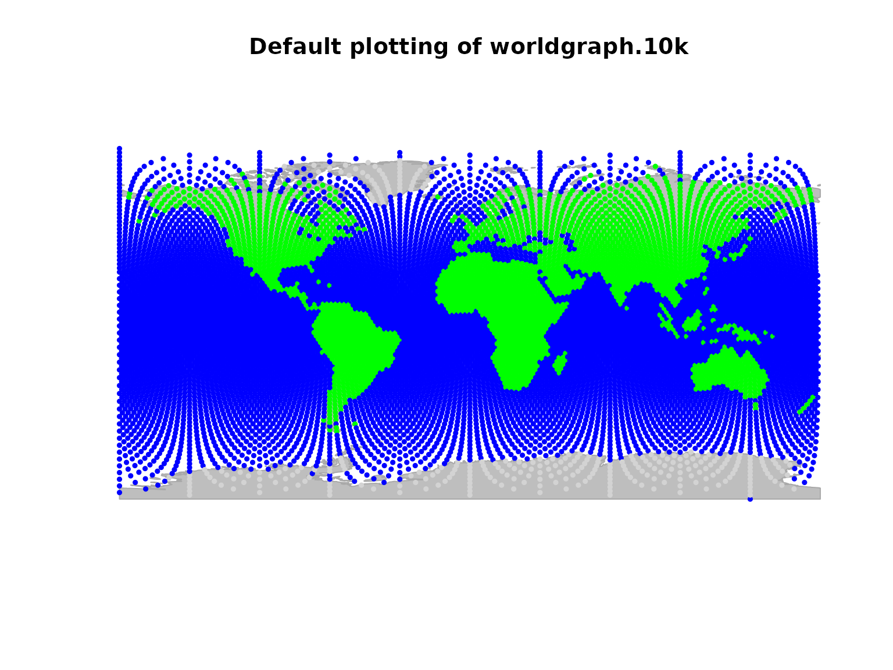
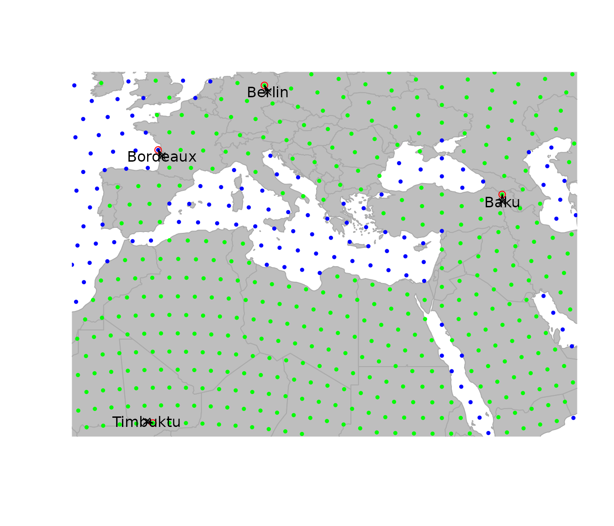
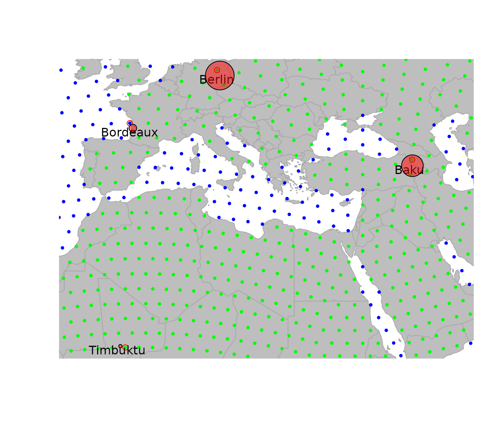
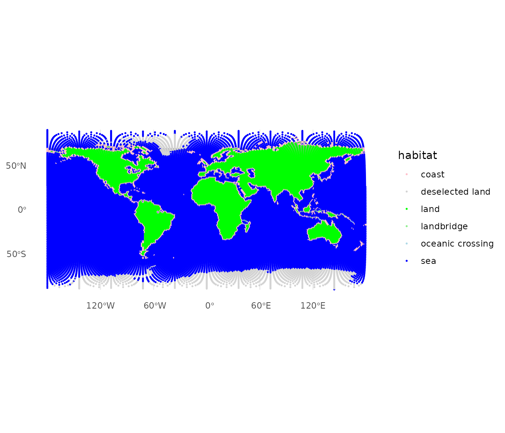
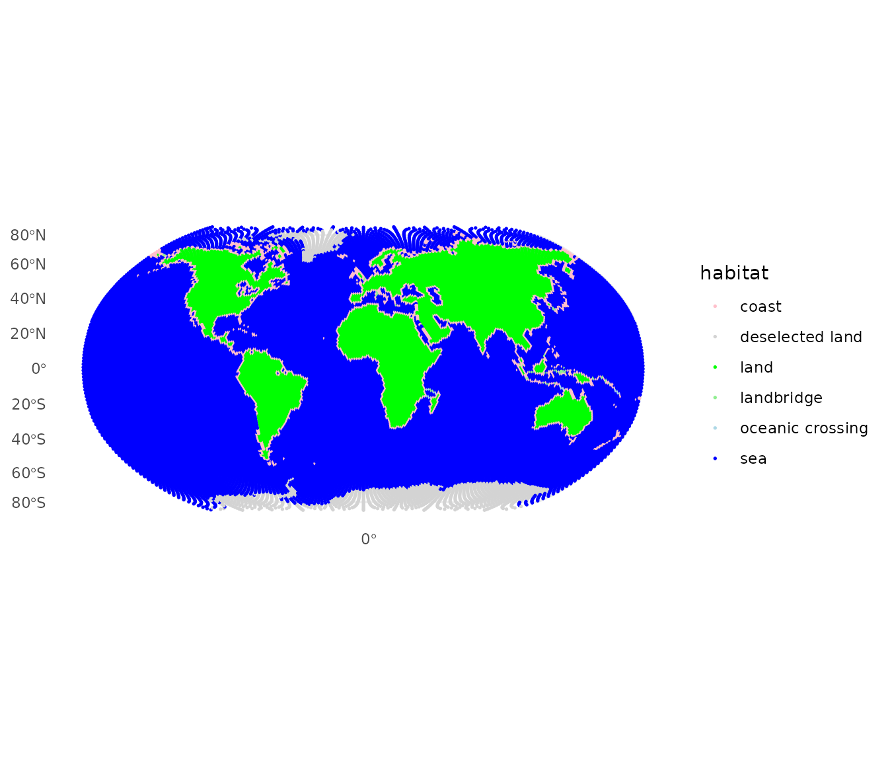
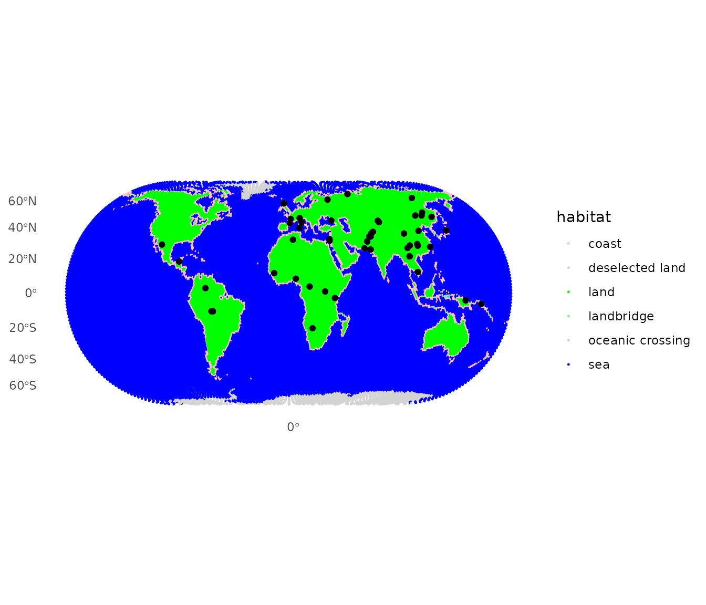
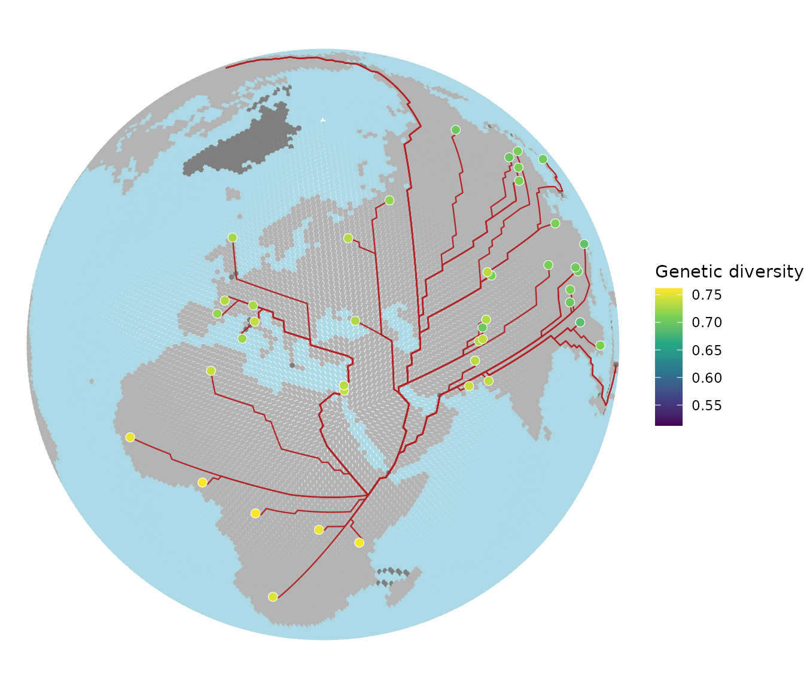

# Data visualization in geoGraph

## Data visualization in *geoGraph*

This vignette will cover the main functions for visualizing all objects
in *geoGrapgh.* It first gives an overview of the basic plotting
functions and then also has a section for more advanced visualization
using `ggplot2.`

### Basic visualizing

An essential aspect of spatial analysis lies in visualizing the data. In
*geoGraph*, the spatial grids (`gGraph`) and spatial data (`gData`) can
be plotted and browsed using a variety of functions.

#### Plotting `gGraph` objects

Displaying a `gGraph` object is done through `plot` and `points`
functions. The first opens a new plotting region, while the second draws
in the current plotting region; functions have otherwise similar
arguments (see
[`?plot.gGraph`](https://evolecolgroup.github.io/geograph/dev/reference/plot-gGraph.md)).

By default, plotting a `gGraph` displays the grid of nodes overlaying a
shapefile (by default, the landmasses). Edges can be plotted at the same
time (argument `edges`), or added afterwards using `plotEdges`. If the
`gGraph` object possesses an adequately formed `meta$colors` component,
the colors of the nodes are chosen according to the node attributes and
the color scheme specified in `meta$colors`. Alternatively, the color of
the nodes can be specified via the `col` argument in `plot`/`points`.

Here is an example using `worldgraph.10k`:

``` r

getColors(worldgraph.10k, res.type = "rules")
```

    ##            habitat       color
    ## 1              sea        blue
    ## 2             land       green
    ## 3         mountain       brown
    ## 4       landbridge light green
    ## 5 oceanic crossing  light blue
    ## 6  deselected land   lightgray

``` r

head(getNodesAttr(worldgraph.10k))
```

    ##   habitat
    ## 1     sea
    ## 2     sea
    ## 3     sea
    ## 4     sea
    ## 5     sea
    ## 6     sea

``` r

table(getNodesAttr(worldgraph.10k))
```

    ## habitat
    ## deselected land            land             sea 
    ##             290            2632            7320

``` r

plot(worldgraph.10k, reset = TRUE)
```

    ## Spherical geometry (s2) switched off

    ## Spherical geometry (s2) switched on

``` r

title("Default plotting of worldgraph.10k")
```



It may be worth noting that plotting `gGraph` objects involves plotting
a fairly large number of points and edges. On some graphical devices,
the resulting plotting can be slow. For instance, one may want to
disable `cairo` under linux: this graphical device yields better
graphics than `Xlib`, but at the expense of increased computational
time. To switch to `Xlib`, type:

``` r

X11.options(type = "Xlib")
```

and to revert to `cairo`, type:

``` r

X11.options(type = "cairo")
```

#### Plotting `gData` objects

`gData` objects are by default plotted overlaying the corresponding
`gGraph`. To show this, we use the `cities` example from the vignette
‘get started’:

``` r

bordeaux <- c(-1, 45)
berlin <- c(13, 52)
baku <- c(44, 40)
timbuktu <- c(-3, 16)

cities.dat <- rbind.data.frame(bordeaux, berlin, baku, timbuktu)
colnames(cities.dat) <- c("lon", "lat")
row.names(cities.dat) <- c("Bordeaux", "Berlin", "Baku", "Timbuktu")
cities.dat$pop <- c(250000, 3500000, 2000000, 50000)
cities.dat
```

    ##          lon lat     pop
    ## Bordeaux  -1  45  250000
    ## Berlin    13  52 3500000
    ## Baku      44  40 2000000
    ## Timbuktu  -3  16   50000

``` r

cities <- new("gData", coords = cities.dat[, 1:2], data = cities.dat[, 3, drop = FALSE], gGraph.name = "worldgraph.10k")
plot(cities, type = "both", reset = TRUE)
```

    ## Spherical geometry (s2) switched off

    ## Spherical geometry (s2) switched on

``` r

text(getCoords(cities), rownames(getData(cities)))
```



Note the argument `reset=TRUE`, which tells the plotting function to
adapt the plotting area to the geographic extent of the dataset.

To plot additional information, it can be useful to extract the spatial
coordinates from the data. This is achieved by `getCoords`. This method
takes an extra argument `original`, which is TRUE if original spatial
coordinates are sought, or FALSE for coordinates of the nodes on the
grid. We can use this to represent, for instance, the population sizes
for the different cities:

``` r

transp <- function(col, alpha = .5) {
  res <- apply(
    col2rgb(col), 2,
    function(c) rgb(c[1] / 255, c[2] / 255, c[3] / 255, alpha)
  )
  return(res)
}

plot(cities, reset = TRUE)
```

    ## Spherical geometry (s2) switched off

    ## Spherical geometry (s2) switched on

``` r

par(xpd = TRUE)
text(getCoords(cities) + -.5, rownames(getData(cities)))
symbols(getCoords(cities)[, 1], getCoords(cities)[, 2],
  circ = sqrt(unlist(getData(cities))), inch = .2,
  bg = transp("red"), add = TRUE
)
```



### Autoplotting and advanced visualization

Now if we want to have more advanced visualization and publication ready
plots, we can use the `autoplot` functions that are based on `ggplot2`.
Currently there are `autoplot` methods for `gGraph` and `gData` objects
that provide a quick way to visualize the data. For even more
customization, we can directly use the underlying `geom_ggraph`,
`geom_gdata` and `geom_gpath` functions that allow for more control over
the plotting. Under the hood these functions convert the `gGraph`,
`gData` and `gPath` objects into `sf` objects that can be plotted using
`ggplot2`.

#### Autoplotting `gGraph` and `gData` objects

For `gGraph` objects the `autoplot` function will by default return a
`ggplot` object with the nodes colors based on the first node attribute
and the edges (if specified as edges = `TRUE`) drawn in grey.

``` r

autoplot(worldgraph.40k)
```


Because the ggplot layers convert the graph’s coordinates to `sf`
geometry internally, we have full access to the projections supported by
`sf`. By default `autoplot` uses an equirectangular projection
(longitude and latitude plotted directly). To use a different
projection, add
[`coord_sf()`](https://ggplot2.tidyverse.org/reference/ggsf.html) with
the desired CRS. For example, the Robinson projection often used for
world maps:

``` r

autoplot(worldgraph.40k) + coord_sf(crs = "+proj=robin")
```

    ## Coordinate system already present.
    ## ℹ Adding new coordinate system, which will replace the existing one.



Similarly when we want to plot a `gData` object, we can use the
`autoplot` function. By default, the linked `gGraph` will be plotted as
well. If we want to plot only the `gData` object, we can set the
`show.gGraph` argument to `FALSE`. Again, we can use the `coord_sf`
function to change the projection of the plot.

``` r

autoplot(hgdp) + coord_sf(crs = "+proj=eck4")
```

    ## Coordinate system already present.
    ## ℹ Adding new coordinate system, which will replace the existing one.



#### More advanced plots using `geom_ggraph`, `geom_gdata` and `geom_gpath`

Finally if we want to have more control over the plotting, we can use
the `geom_ggraph`, `geom_gdata` and `geom_gpath` functions. These
functions allow us to customize the plots using the full power of
`ggplot2`. Lets say for example we want to plot the example from the
`Get Started` vignette, we can use the `geom_gpath` function to plot the
paths and the `geom_gdata` function to plot the HGDP populations.
Finally we can use the `coord_sf` function to change the projection of
the plot to orthographic and set custom colors for the land, sea and
coast.

``` r

addis <- list(lon = 38.74, lat = 9.03)
addis_node <- closestNode(worldgraph.40k, addis)
myPath <- dijkstraFrom(hgdp, addis_node)

ggplot() +
  geom_ggraph(data = worldgraph.40k, aes(color = habitat),
              edges = FALSE, size = 1, show.legend = FALSE) +
  scale_color_manual(values = c(land = "grey70", sea = "lightblue",
                                 coast = "grey70")) +
  geom_gpath(data = myPath, color = "firebrick", linewidth = 0.4) +
  geom_gdata(data = hgdp, aes(fill = Genetic.Div),
             shape = 21, color = "white", size = 2.5, stroke = 0.3) +
  scale_fill_viridis_c(name = "Genetic diversity") +
  coord_sf(crs = "+proj=ortho +lat_0=40 +lon_0=30") +
  theme_void()
```


