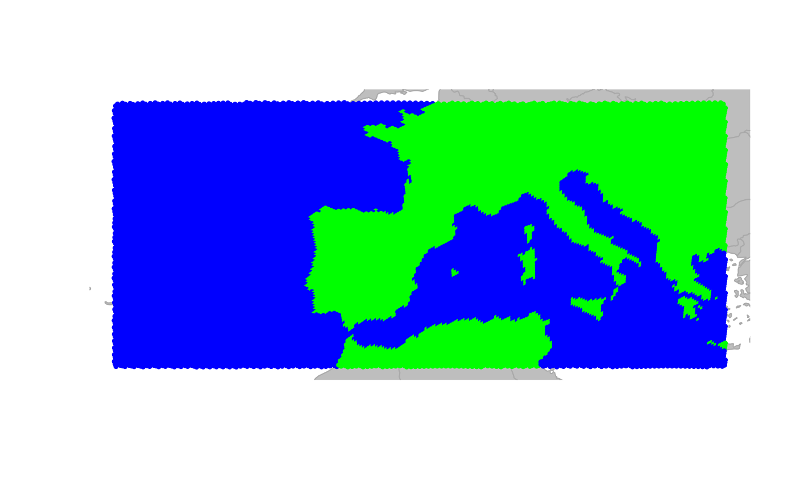
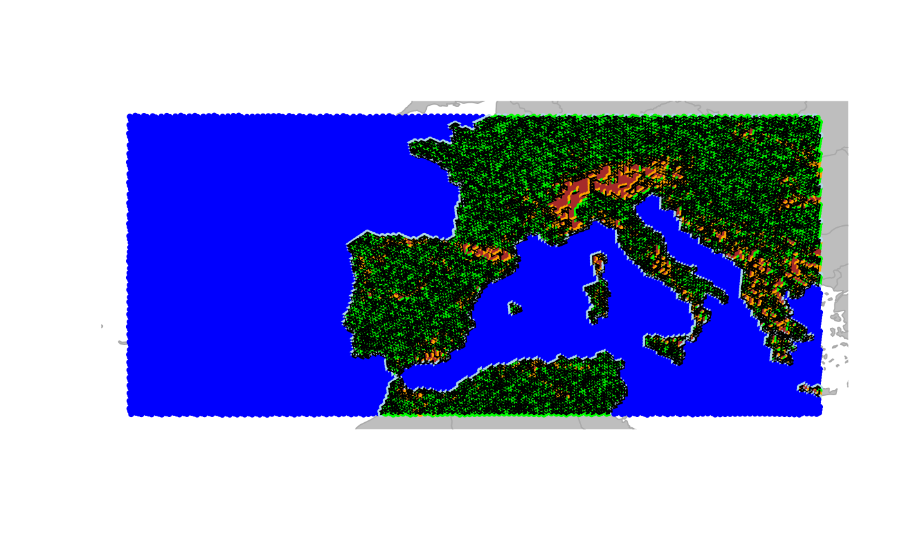
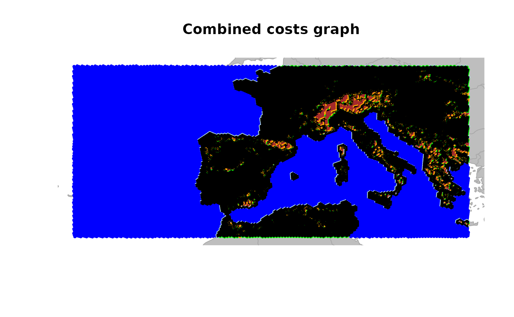
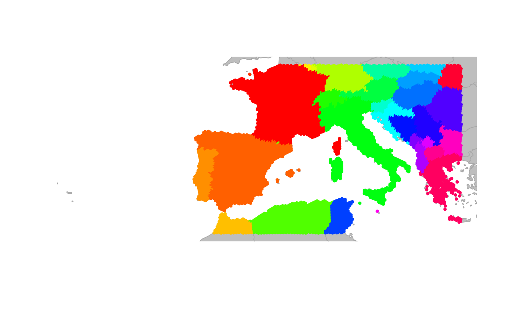
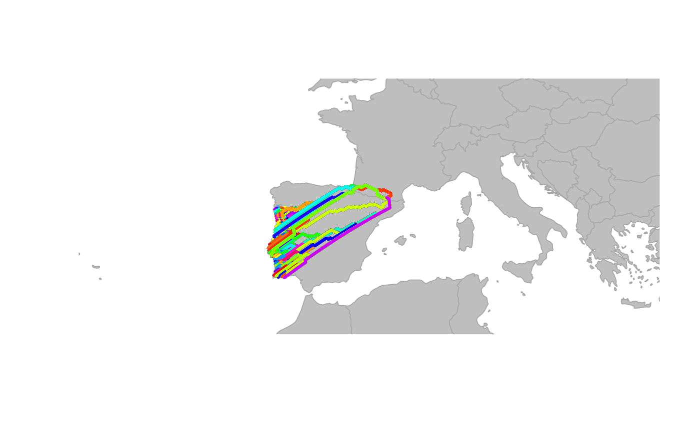

# Making custom grids in geoGraph

## Using discrete global grids in *geoGraph*

This vignette illustrates how to create custom graphs in *geoGraph*
using discrete global grids. This is especially useful when working over
larger areas of the world, where a rectangular grid would introduce
messy distortions. Using the `dggridR` package, we can create a custom
hexagonal grids that provides a more accurate representation of the
Earth’s surface. We will then use this grid to create a `gGraph` object
in *geoGraph* and assign environmental information to the nodes of the
graph. This allows us to create a cost surface for connectivity analysis
that takes into account both land/water classification and elevation
variability.

#### Getting the elevation data

In the first step, we define the area of interest using a bounding box
and then use the `get_elev_raster` function from the `elevatr` package
to retrieve topographical and bathymetry data for that area. The
resulting data is then converted to a `SpatRaster` object using the
`rast` function from the `terra` package.

``` r

# define the area of interest (Europe)
area_of_interest <- st_as_sfc(
  st_bbox(c(
    xmin = -25,
    xmax = 25,
    ymin = 34,
    ymax = 50
  ), crs = 4326)
)

aoi_bound <- st_sf(geometry = area_of_interest)

elevation_data <- get_elev_raster(
  locations = aoi_bound,
  z = 4,
  clip = "locations"
)

# convert to SpatRaster
spatr <- rast(elevation_data)
plot(spatr)
```


##### Makeing a land mask

Using this `SpatRaster` we can create a land mask by using the
`make_land_mask` function from the `pastclim` package. This function
identifies land and ocean areas based on the simple logic of moving the
ocean up and down given the current relief profile for the time of
choice. In this case, we use the present time (0 years before present)
to create a land mask for our area of interest.

``` r

# make land mask (everything above 0m is land)
land_mask <- make_land_mask(spatr, time_bp = 0) # using the present time
land_mask[is.na(land_mask)] <- 0 
plot(land_mask)
```


#### Creating the graph object

Next, we create a new graph object using the `createNewGraph` function
from the `geoGraph` package. We specify the geographic bounding box for
for our area of interest and set the spacing between nodes in the graph.
The resulting graph object represents a grid over the area of interest
with cells of the about 16km spacing, and we can visualize the graph
structure using the `plot` and `plotEdges` functions.

``` r

ggraph <- createNewGraph(geo_box = aoi_bound, spacing = 20)
```

    ## Resolution: 11, Area (km^2): 287.933536398634, Spacing (km): 16.758963498128, CLS (km): 19.147021538141

``` r

plot(ggraph, reset = TRUE)
plotEdges(ggraph)
```


#### Adding the land/water mask to the graph

We then use the `assignRasterPoints` function to add the land/water mask
to the graph. This function takes the graph object and the land mask
raster as inputs and assigns the land/water values to the corresponding
cells in the graph. In this example we classify each cell with land
points in it as land by defining the `fun` parameter in
`collapseNodeAttribute` as ‘min’, which means that if there is at least
one water point in the cell, the cell will be classified as water. We
can then visualize the resulting graph with the land/water mask by
plotting the graph and coloring the nodes based on the land/water
values.

``` r

water_graph <- assignRasterPoints(
  graph = ggraph,
  raster = land_mask,
  layer_name = "water"
)

# now we collapse the water attribute to get a land/sea classification for each node
water_land_graph <- collapseNodeAttribute(
  graph = water_graph,
  attribute = "water",
  fun = min,
  na.rm = TRUE
)

# add this to the habitat attribute
habitat <- factor(water_land_graph@nodes.attr$water,
  levels = c(0, 1),
  labels = c("sea", "land")
)

# reclassify the nodes in the gGraph object accordingly in the metadata
water_land_graph@nodes.attr$habitat <- habitat #TODO can we use a setAttribute here?

colors <- data.frame(
  habitat = c("sea", "land"),
  cost = c("blue", "green")
)

# change colors associated with the land meta info
water_land_graph@meta$colors <- colors

plot(water_land_graph, reset = TRUE)
```



##### Setting costs for the different habitat types

Finally, we can set the costs for moving through different habitat types
based on their classification. Note that the cost here is arbitrary and
can be adjusted based on the specific context of the analysis and the
species or features being studied. Costs are inversely related to the
ease of movement through a cell, so higher costs indicate more difficult
terrain. For example, we can assign a cost of 10 for moving through sea
cells and a cost of 1 for moving through land cells. If we now look at
the least cost path between two cities (Madrid and Naples) using the
`dijkstraBetween` function, we can see that the path tends to avoid sea
cells and prefers to move through land cells.

``` r

# set the costs for sea cells to 10 and land cells to 1
sea_cost <- 10
land_cost <- 1
water_land_graph@meta$costs <- data.frame(
  habitat = c("sea", "land"),
  cost = c(sea_cost, land_cost)
)

water_land_graph <- setCosts(water_land_graph, method = "mean", attr.name = "habitat")


point1 <- c(-3.7038, 40.4168) # Madrid
point2 <- c(14.2681, 40.8522) # Naples
cities.dat <- rbind.data.frame(point1, point2)
colnames(cities.dat) <- c("lon", "lat")
row.names(cities.dat) <- c("Madrid", "Naples")
cities <- new("gData", coords = cities.dat[, 1:2], gGraph.name = "water_land_graph")
path <- dijkstraBetween(cities)
plot(water_land_graph, reset = TRUE)
plot(path, col = "red", lwd = 2)
```


#### Assigning elevation data to graph nodes

In the next step we can then use the `assignRasterPoints` function again
to add elevation data to the nodes of the graph. In this case we need to
chose how to incorporate the elevation data into the graph, since each
node will have multiple raster points associated with it. So before
using the `collapseNodeAttribute` function to get a single elevation
value for each node, we can first have a look at the standard deviation
of the elevation values for each node, which gives us an idea of the
variability of elevation within each cell. This can be useful for
identifying rugged areas, which typically have high variability in
elevation and a higher cost of traveling through associated. For this we
set the `fun` parameter in the `collapseNodeAttribute` function to `sd`,
which calculates the standard deviation of the elevation values for each
node. We can then visualize the distribution of the standard deviation
of elevation values for land cells by plotting a density plot.

``` r

elevation_graph <- assignRasterPoints(
  graph = water_land_graph,
  raster = spatr,
  layer_name = "elevation"
)

# now we collapse the elevation attribute to get the sd of the elevation for each node
elevation_graph <- collapseNodeAttribute(
  graph = elevation_graph,
  attribute = "elevation",
  fun = sd,
  na.rm = TRUE
)

# have a look at the distribution of sd_elevation values for land cells
sd_ele <- getNodesAttr(elevation_graph)%>%
  mutate(
    elevation = ifelse(habitat == "land", elevation, NA_real_)
  ) %>%
  pull(elevation)

# plot the density
plot(density(log(sd_ele), na.rm = TRUE),
  main = "Density of SD Elevation for Land Cells",
  xlab = "SD Elevation (m)", ylab = "Density"
)
```


#### Reclassify the nodes into ‘rugged’ and ‘very rugged’

Looking at the distribution of the standard deviation of elevation
values for land cells, we can see that there are some cells with very
high variability in elevation, which likely correspond to mountainous
areas. We can then reclassify the nodes into ‘rugged’ and ‘very rugged’
based on an elevation threshold. Here we pick arbitrary thresholds for
the standard deviation of elevation values to classify cells as ‘rugged’
and ‘very rugged’. Cells with a standard deviation of elevation greater
than 100 are classified as ‘rugged’, while those with a standard
deviation greater than 150 are classified as ‘very rugged’. We can then
update the habitat attribute in the graph accordingly and visualize the
resulting graph with the new habitat classifications.

``` r

# set a threshold for rugged cells
rugged_threshold <- 150
very_rugged_threshold <- 300

## now we identify rugged and very rugged cells as those with sd_elevation > threshold
habitat_new <- case_when(
  is.na(sd_ele) ~ "sea",
  sd_ele > very_rugged_threshold ~ "very_rugged",
  sd_ele > rugged_threshold ~ "rugged",
  TRUE ~ "land"
)

# update the habitat attribute in the graph
# reclassify the nodes in the gGraph object accordingly in the metadata
elevation_graph@nodes.attr$habitat <- habitat_new


colors <- data.frame(
  habitat = c("sea", "land", "rugged", "very_rugged"),
  cost = c("blue", "green", "orange", "brown")
)

# change colors associated with the land meta info
elevation_graph@meta$colors <- colors

plot(elevation_graph, reset = TRUE)
```


Now if we now set the cost for rugged and very rugged cells to be higher
than for land cells, we can see that the least cost paths between
different land areas tend to avoid not only sea cells but also rugged
and very rugged cells. This can be shown in the same toy example as
above.

``` r

# set the costs for sea cells to 10, land cells to 1, rugged cells to 3 and very rugged cells to 10
sea_cost <- 10
land_cost <- 1
rugged_cost <- 3
very_rugged_cost <- 10
elevation_graph@meta$costs <- data.frame(
  habitat = c("sea", "land", "rugged", "very_rugged"),
  cost = c(sea_cost, land_cost, rugged_cost, very_rugged_cost)
)
elevation_graph <- setCosts(elevation_graph, method = "mean", attr.name = "habitat")
point1 <- c(-3.7038, 40.4168) # Madrid
point2 <- c(14.2681, 40.8522) # Naples
cities.dat <- rbind.data.frame(point1, point2)
colnames(cities.dat) <- c("lon", "lat")
row.names(cities.dat) <- c("Madrid", "Naples")
cities <- new("gData", coords = cities.dat[, 1:2], gGraph.name = "elevation_graph")
path <- dijkstraBetween(cities)
plot(elevation_graph, reset = TRUE)
plot(path, col = "red", lwd = 2)
```


#### Adding coastal cells

Now in a last step we can add a ‘coast’ category to the habitat
classification for cells that are adjacent to any land based cells. This
is done by checking the neighbors of each sea cell and reclassifying
those that have at least one land or mountain neighbor as ‘coast’. We
can then visualize the resulting graph with the new habitat
classifications, including the coastal cells.

``` r

# get the neighbor list from the graph
neigh_list <- elevation_graph@graph@edgeL
node_attr <- getNodesAttr(elevation_graph)

# get all nodes adjacent to land or mountain cells and reclassify them as "coast"
for (i_node in 1:nrow(node_attr)) {
  if (node_attr$habitat[i_node] == "sea") {
    neighbour_indices <- neigh_list[[i_node]]$edges # check structure!
    neighbour_land_values <- node_attr$habitat[neighbour_indices]
    if (any(neighbour_land_values %in% c("land", "rugged", "very_rugged"))) {
      # at least one land or mountain neighbour
      node_attr$habitat[i_node] <- "coast"
    }
  }
}

new_attribute <- node_attr

# create the full_graph
full_graph <- elevation_graph

# set the new node attributes
full_graph@nodes.attr <- new_attribute


colors <- data.frame(
  habitat = c("sea", "land", "rugged", "very_rugged", "coast"),
  cost = c("blue", "green", "orange", "brown", "lightblue")
)

# change the costs and colors associated with the land meta info
full_graph@meta$colors <- colors
plot(full_graph, reset = TRUE)
```


Now if we set the cost for coastal cells to be the same as for land
cells, we can see that the least cost paths between different land areas
tend to prefer crossing coastal cells over crossing rugged areas.

``` r

# set the costs for sea cells to 10, land cells to 1, rugged cells to 3, very rugged cells to 10 and coastal cells to 1
sea_cost <- 10
land_cost <- 1
rugged_cost <- 3
very_rugged_cost <- 10
coastal_cost <- 1
full_graph@meta$costs <- data.frame(
  habitat = c("sea", "land", "rugged", "very_rugged", "coast"),
  cost = c(sea_cost, land_cost, rugged_cost, very_rugged_cost, coastal_cost)
)
full_graph <- setCosts(full_graph, method = "mean", attr.name = "habitat")

point1 <- c(-3.7038, 40.4168) # Madrid
point2 <- c(14.2681, 40.8522) # Naples
cities.dat <- rbind.data.frame(point1, point2)
colnames(cities.dat) <- c("lon", "lat")
row.names(cities.dat) <- c("Madrid", "Naples")
cities <- new("gData", coords = cities.dat[, 1:2], gGraph.name = "full_graph")
path <- dijkstraBetween(cities)
plot(full_graph, reset = TRUE)
plot(path, col = "red", lwd = 2)
```


#### Using different methods to calculate costs

So far the costs for moving through different habitat types were defined
by the mean of the costs associated with the different habitat types.
However, the `setCosts` function allows to use different methods to
calculate the costs for each edge based on the node attributes. For
example, instead of using the mean, we could specify a custom function
that takes the maximum cost of the two nodes connected by an edge, which
would mean that the cost of moving through an edge is determined by the
more difficult habitat type of the two nodes. This can be done by
defining a custom function `max.cost` and then using it in the
`setCosts` function with the method set to “function”. The resulting
graph will have costs for each edge that reflect the maximum cost of the
two nodes it connects.

``` r

max.cost <- function(x1, x2) {
  pmax(x1, x2)
}

full_graph <- setCosts(
  full_graph,
  attr.name = "habitat",
  method = "function",
  FUN = max.cost
)

plot(full_graph, reset = TRUE)
plotEdges(full_graph)
```


#### Combining costs

In many ecological applications, connectivity across landscapes depends
on multiple environmental constraints rather than a single variable. In
the previous sections we constructed terrain-based costs that capture
differences in movement through sea, land, rugged, and very rugged
areas. However, climatic factors can also influence movement and
dispersal. To illustrate how multiple environmental layers can be
incorporated into a connectivity model, we now add an additional
environmental gradient: `temperature`, which in this example is a random
variable that we assign to the nodes of the graph. The movement cost
between two nodes can then be defined as a function of the difference in
temperature between the two nodes, with a cost that increases as the
temperature difference increases. The `setCosts` function is then used
to apply this cost function to the graph based on the temperature values
assigned to each node.

``` r

exp.cost <-
  exp.cost <- function(x1, x2, cost.coeff) {
    exp(-abs(x1 - x2) * cost.coeff)
  }

# create a set of node costs for temperature
land_graph <- dropDeadEdges(full_graph, thres = 9)
land_graph@nodes.attr$temp <- runif(n = 25821)
temperature_graph <-
  setCosts(
    land_graph,
    node.values = land_graph@nodes.attr$temp,
    method = "function",
    FUN = exp.cost,
    cost.coeff = 1
  )

plot(temperature_graph, edge = TRUE)
plotEdges(temperature_graph)
```



Now we want a combined cost that both captures the temperature as well
as the terrain. For this we can use the `combineCosts` function, which
allows to combine costs from two different graphs using a specified
method (sum, product, or a custom function). Here we will use the `prod`
method to combine the costs from the `temperature_graph` and the
`land_graph`, which multiplies the costs from both graphs to create a
new cost that reflects both the temperature and terrain constraints on
movement.

``` r

combine_costs_graph <- combineCosts(temperature_graph, land_graph, method = "prod")

plot(combine_costs_graph, edge = TRUE)
plotEdges(combine_costs_graph)
title("Combined costs graph")
```



### Extracting information from GIS shapefiles

In the previous sections, we extracted environmental information from
raster layers and assigned it to graph nodes using `assignRasterPoints.`
Another way *geoGraph* can serve as an interface between geographic
information system (GIS) layers and geographic data is the function
`extractFromLayer`. *geoGraph* uses `sf` objects to represent geographic
objects such as points and polygons. By default, *geoGraph* uses the
package *rnaturalearth* to provide continent and country outlines, but
it is possible also to load custom GIS shapefiles with
[`sf::st_read()`](https://r-spatial.github.io/sf/reference/st_read.html).

We start by loading country outlines for the whole world. Note that we
turn off spherical trigonometry functions with `sf::sf_use_s2(FALSE)`,
as the `naturalearth` dataset is not compatible with that functionality.

``` r

library(sf)
sf_use_s2(FALSE)
world.countries <- rnaturalearth::ne_countries(
  scale = "medium",
  returnclass = "sf"
)
```

Let us assume that we are interested in add continent and country
information to the `full_graph` object.

``` r

newGraph <- extractFromLayer(full_graph,
  layer = world.countries,
  attr = c("continent", "name")
)
summary(getNodesAttr(newGraph))
```

    ##      water             habitat        elevation           continent    
    ##  Min.   :0.0000   Length   :25821   Min.   :   0.00   Length   :25821  
    ##  1st Qu.:0.0000   N.unique :    5   1st Qu.:  31.60   N.unique :    2  
    ##  Median :0.0000   N.blank  :    0   Median :  78.48   N.blank  :    0  
    ##  Mean   :0.3725   Min.nchar:    3   Mean   : 115.07   Min.nchar:    6  
    ##  3rd Qu.:1.0000   Max.nchar:   11   3rd Qu.: 154.74   Max.nchar:    6  
    ##  Max.   :1.0000                     Max.   :1298.22   NAs      :15694  
    ##  NAs    :45                         NAs    :83                         
    ##         name      
    ##  Length   :25821  
    ##  N.unique :   32  
    ##  N.blank  :    0  
    ##  Min.nchar:    5  
    ##  Max.nchar:   16  
    ##  NAs      :15694  
    ## 

The new object `newGraph` is a `gGraph` which now includes, for each
node of the grid, the corresponding continent and country retrieved from
the GIS layer. Note that `extractFromLayer` can extract information to
other types of objects than `gGraph` (see
[`?extractFromLayer`](https://evolecolgroup.github.io/geograph/dev/reference/extractFromLayer.md))

We can use the newly acquired information for plotting `newGraph`, by
defining new color rules:

``` r

temp <- unique(getNodesAttr(newGraph)$"name")
col <- c("transparent", rainbow(length(temp) - 1))
colMat <- data.frame(name = temp, color = col)
head(colMat)
```

    ##       name       color
    ## 1     <NA> transparent
    ## 2   France     #FF0000
    ## 3   Jersey     #FF3000
    ## 4    Spain     #FF6000
    ## 5 Portugal     #FF8F00
    ## 6  Morocco     #FFBF00

``` r

tail(colMat)
```

    ##               name   color
    ## 28          Kosovo #DF00FF
    ## 29           Malta #FF00EF
    ## 30        Bulgaria #FF00BF
    ## 31 North Macedonia #FF008F
    ## 32          Greece #FF0060
    ## 33         Ukraine #FF0030

``` r

plot(newGraph, col.rules = colMat, reset = TRUE)
```



This information could in turn be used to define costs for traveling on
the grid. For instance, one could import habitat descriptors from a GIS,
use these values to formulate a habitat model, and derive costs for
dispersal on the grid.

#### Look at connectivity between two polygons

``` r

test <- polygonBetween(newGraph, layer = "name", "Andorra", "Portugal", outline = FALSE)
plot(newGraph, col = NA, reset = TRUE)
plot(test)
```


