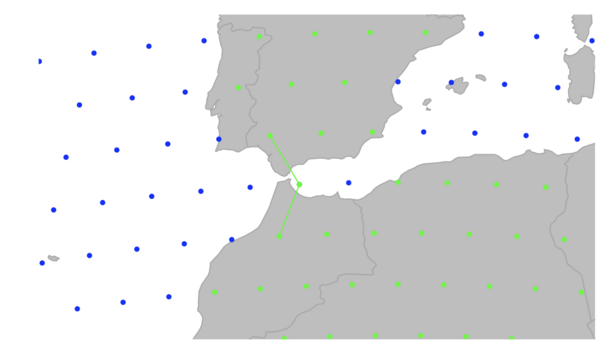

```{r setup, echo=FALSE}
knitr::opts_chunk$set(fig.width = 7, fig.height = 6)
options(digits = 4)
```

*geoGraph*: using spherical grids to walk through the geographic space
=================================================

In this vignette, we go through the basic tasks that can be achieved using
*geoGraph*. A short overview of the functionality of the package is summarized the
package's manpage, accessible via:

```{r eval=FALSE}
?geoGraph
```

*geoGraph* aims at implementing graph approaches for geographic data.
In *geoGraph*, a given geographic area is modeled by a fine regular grid, where each vertex
has a set of spatial coordinates and a set of attributes, which can be for instance habitat
descriptors, or the presence/abundance of a given species.
'traveling' within the geographic area can then be easily modeled as moving between connected vertices.
The cost of moving from one vertex to another can be defined according to attribute values, which
allows for instance to define friction routes based on habitat.

*geoGraph* harnesses the full power of graph algorithms implemented in R by the *graph*
and *RBGL* (R Boost Graph Library) packages.
In particular, *RBGL* is an interface between R and the comprehensive *Boost Graph Library* in C++,
which provides fast and efficient implementations of a wide range of graph algorithms.
Once we have defined frictions for an entire geographic area, we can easily, for instance, find the least
costs path from one location to another, or find the most parsimonious way of connecting a set of locations.


Interfacing spatial data and graphs can be a complicated task.
The purpose of *geoGraph* is to provide tools to achieve and simplify this 'preliminary' step.
This is achieved by defining new classes of objects which are essentially geo-referenced graphs
with node attributes (`gGraph` objects), and interfaced spatial data (`gData` objects).
In this vignette, we show how to install *geoGraph*, construct and handle
`gGraph`/`gData` objects, and illustrate some basic features of graph algorithms.

# First steps

## Installing the package

All the following instructions should be entered from a new R session to avoid errors due to installing attached packages.

You can install `geoGraph` from [GitHub](https://github.com/) with:
```{r eval = FALSE}
install.packages("pak")
pak::pak("EvolEcolGroup/geograph")
```

Once installed, the package can be loaded using:
```{r load, message = FALSE}
library("geoGraph")
```

If you have an error regarding missing packages, you may need to install manually the packages *graph* and *RBGL* from *Bioconductor*:
```{r eval = FALSE}
install.packages("BiocManager")
BiocManager::install(c("graph", "RBGL"))
```

And then attempt to reinstall *geoGraph* from GitHub.

## Data representation

Data representation refers to the way a given type of data is handled by a
computer program.  Two types of objects are used in *geoGraph*: `gGraph`, and
`gData` objects.  Both objects are defined as formal (S4) classes and often have
methods for similar generic function (e.g. `getNodes` is defined for both
objects).  Essentially, `gGraph` objects contain underlying layers of
information, including a spatial grid and possibly node attributes.
`gData` are sets of locations (like sampled
sites, for instance) which have been interfaced to a `gGraph` object, to allow
further manipulations such as finding paths on the grid between pairs of
locations.

### gGraph objects

The definition of the formal class `gGraph` can be obtained using:
```{r }
getClass("gGraph")
```
and a new empty object can be obtained using the constructor:
```{r }
new("gGraph")
```

The documentation `?gGraph` explains the basics about the object's content.  In
a nutshell, these objects are spatial grids with nodes and segments connecting
neighboring nodes, and additional information on the nodes or on the graph
itself.  `coords` is a matrix of longitudes and latitudes of the nodes.
`nodes.attr` is a data.frame storing attributes of the nodes, such as habitat
descriptors; each row corresponds to a node of the grid, while each column
corresponds to a variable.  `meta` is a list containing miscellaneous
information about the graph itself.  There is no constraint applying to the
components of the list, but some typical components such as `$costs` or
`$colors` will be recognized by certain functions.  For instance, you can
specify plotting rules for representing a given node attribute by a given color
by defining a component `$colors`.  Similarly, you can associate costs to a
given node attribute by defining a component `$costs`.  An example of this can
be found in already existing `gGraph` objects.  For instance, `worldgraph.10k`
is a graph of the world with approximately 10,000 nodes, and only on-land
connectivity *i.e. no traveling on the seas*.  

```{r } 
worldgraph.10k@meta
``` 

Lastly, the `graph` component is a `graphNEL` object,
which is the standard class for graphs in the *graph* and *RBGL* packages.  This
object contains all information on the connections between nodes, and the
weights (costs) of these connections.

Four main `gGraph` are provided with *geoGraph*: `rawgraph.10k`, `rawgraph.40k`,
`worldgraph.10k`, and `worldgraph.40k`.  These datasets are available using the
command `data`.  The grid used in these datasets are the best geometric
approximation of a regular grid for the surface of a sphere.  One advantage of
working with these grids is that we do not have to use a projection for
geographic coordinates, which is a usual issue in regular GIS.

The difference between rawgraphs and worldgraphs is that the first are entirely
connected, while in the second connections occur only on land.  Numbers `10k'
and `40k' indicate that the grids consist of roughly 10,000 and 40,000 nodes.
For illustrative purposes, we will often use the 10k grids, since they are less
heavy to handle.  For most large-scale applications, the 40k versions should
provide sufficient resolution.  New `gGraph` can be constructed using the
constructor (`new(...)`). A more detailed description of how to construct custom `gGraph` is provided in the vignette 'Making custom grids in geoGraph' (see `vignette()` for more information on available vignettes).

### gData objects

`gData` objects store sets of locations interfaced with a `gGraph` object. When creating a `gData`, each location is matched to its closest node on the gGraph grid, which makes it possible to model travel between locations along the grid — for instance, to find the shortest path between two sites through different habitat types.

Like for `gGraph`, the content of the formal class `gData` can be obtained using:
```{r }
getClass("gData")
```
and a new empty object can be obtained using the constructor:
```{r }
new("gData")
```

As before, the description of the content of these objects can be found in the
documentation (`?gData`).  `coords` is a matrix of xy (longitude/latitude)
coordinates in which each row is a location.  `nodes.id` is a vector of characters
giving the name of the vertices matching the locations; this is defined
automatically when creating a new `gData`, or using the function `closestNode`.
`data` is a slot storing data associated to the locations; it can be any type of
object, but a data.frame should cover most requirements for storing data.  Note
that this object should be subsettable (i.e. the `[` operator should be
defined), so that data can be subsetted when subsetting the `gData` object.
Lastly, the slot `gGraph.name` contains the name of the `gGraph` object to which
the `gData` has been interfaced.

In the next sections, we illustrate how we can build and use `gData`
objects from a set of locations. 

# Getting started with *geoGraph*

## Importing geographic data

GeoGraphic data consist of a set of locations, possibly accompanied by
additional information.  For instance, one may want to study the migrations
among a set of biological populations with known geographic coordinates.  In
*geoGraph*, geographic data are stored in `gData` objects.  These objects match
locations to the closest nodes on a grid (a `gGraph` object), and store
additional data if needed.

As a toy example, let us consider four locations: Bordeaux in France, Berlin in Germany, Baku in Azerbaijan, and Timbuktu in Mali. Since we will be working with a crude grid (10,000 nodes), locations need not be exact.  
We enter the longitudes and latitudes (in this order, that is, xy coordinates) of these cities in
decimal degrees, as well as approximate population sizes:

```{r cities}
Bordeaux <- c(-1, 45)
Berlin <- c(13, 52)
Baku <- c(44, 40)
Timbuktu <- c(-3, 16)

cities.dat <- rbind.data.frame(Bordeaux, Berlin, Baku, Timbuktu)
colnames(cities.dat) <- c("lon", "lat")
row.names(cities.dat) <- c("Bordeaux", "Berlin", "Baku", "Timbuktu")
cities.dat$pop <- c(250000, 3500000, 2000000, 50000)
cities.dat
```
We load a `gGraph` object which contains the grid that will support the data:
```{r wg10plot, fig = TRUE, fig.width = 8}
plot(worldgraph.10k)
```

In this figure, each node is represented with a color depending on the habitat type, either 'sea'
(blue) or 'land' (green).  We are going to interface the cities data with this
grid; to do so, we create a `gData` object using `new` (see `?gData` object):


```{r citiesplot, fig=TRUE}
cities <- new("gData", coords = cities.dat[, 1:2], data = cities.dat[, 3, drop = FALSE], gGraph.name = "worldgraph.10k")
cities
plot(cities, type = "both", reset = TRUE)
plotEdges(worldgraph.10k)
```

This figure illustrates the matching of original locations (black crosses) to nodes of the grid
(red circles).
As we can see, an issue occurred for Bordeaux, which has been assigned to a node in the sea (in blue).
Locations can be re-assigned to nodes with restrictions for some node attribute values using
`closestNode`; for instance, here we constrain matching nodes to have an `habitat` value
(defined as node attribute in `worldgraph.10k`) equaling `land` (green points):
```{r closeNode, fig=TRUE}
cities <- closestNode(cities, attr.name = "habitat", attr.value = "land")
plot(cities, type = "both", reset = TRUE)
plotEdges(worldgraph.10k)
```

Now, all cities have been assigned to a `land` node of the grid.
Content of `cities` can be accessed via various accessors (see `?gData`).
For instance, we can retrieve original locations, assigned nodes, and stored data using:
```{r }
getCoords(cities)
getNodes(cities)
getData(cities)
```

More interestingly, we can now retrieve all the geographic information contained in the underlying
grid (*i.e.* `gGraph` object) as node attributes:
```{r }
getNodesAttr(cities)
```
In this example, the information stored in `worldgraph.10k` is rather crude: `habitat` only
distinguishes the land from the sea.

## Finding least-cost paths

One of the most useful applications of *geoGraph* is the research of least-cost paths between
couples of locations.
This can be achieved using the functions `dijkstraFrom` and `dijkstraBetween` on a
`gData` object which contains all the locations of interest.
These functions return least-cost paths with the format `gPath`.
`dijkstraFrom` compute the paths from a given node of the grid to all locations of the
`gData`, while `dijkstraBetween` computes the paths between pairs of locations of the
`gData`.
Below, we illustrate the use of `dijkstraBetween` to find the least-cost paths between all pairs of cities in our example.

First, we check that all populations are connected on the grid using `isConnected`:
```{r }
isConnected(cities)
```

If not all locations are connected, `connectivityPlot` can help diagnose the problem by displaying connected components in different colors, and is available for both `gGraph` and `gData` objects. For instance:

```{r connectivityPlot, fig.width = 8}
connectivityPlot(worldgraph.10k, edges = TRUE, seed = 1, reset = TRUE)
```
Since all locations in `cities` are connected, we can proceed further.

We can now compute least-cost paths between all pairs of cities using `dijkstraBetween`:

```{r }
cities.paths <- dijkstraBetween(cities)
cities.paths
plot(cities, reset = TRUE)
plot(cities.paths)
```

In this graph, each path is plotted with a different color, but several paths overlap in several places. We can clearly see that all paths go through the Caucasus mountains, which is the only land connection between Europe and Africa in this grid. Depending on the application, this may be a problem, since the Strait of Gibraltar is a more likely route for traveling between these two continents.  In the next section, we show how to change local properties of a `gGraph` to allow for a connection at the Strait of Gibraltar.

### Changing local properties of a `gGraph`

In the current version of `worldgraph.10k`, there is no connection at the Strait of Gibraltar as the grid is designed to only allow for land to land connectivity. We can visually check this by zooming in on the area of interest and plotting the edges of the grid:

```{r}
geo.zoomin(c(-10, 2, 32, 40))
plotEdges(worldgraph.10k)
geo.bookmark("gibraltar") # TODO explain this
```

We can change this by adding a connection between the two continents, for instance by adding a connection between the two nodes of the grid which are closest to the Strait of Gibraltar. Adding and removing edges from the grid of a `gGraph` can be achieved by `geo.add.edges` and `geo.remove.edges`, respectively.
These functions are interactive, and require the user to select individual nodes or a rectangular
area in which edges are added or removed.
See `?geo.add.edges` for more information on these functions.
For instance, we can add the above-mentioned connection between Europe and Africa by selecting the two nodes of the grid closest to the Strait of Gibraltar, and adding a connection between them. For this we just run the 
'geo.add.edges' function, and then click on the two nodes of the grid that we want to connect (in this case, one node in Europe and one node in Africa). After adding the edge, we can save the new graph as a new object
(note that we have to save the changes using `<-`):

```{r eval=FALSE}
newGraph <- worldgraph.10k
plot(newGraph)
newGraph <- geo.add.edges(newGraph)
```

```{r eval=TRUE, echo=FALSE}
newGraph <- readRDS("Robjects/gibraltar_graph.RDS")
```

We can then assign the new graph using the `setGraph` function, so that the new graph will be used for path computations. Now when we compute least-cost paths between cities, we can see that the path between Bordeaux and Timbuktu goes through the Strait of Gibraltar instead of the Caucasus mountains:

```{r }
cities <- setGraph(cities, "newGraph")
cities.paths <- dijkstraBetween(cities)
plot(cities, reset = TRUE)
plot(cities.paths)
```

### Example application using the Human Genome Diversity Panel

Here we show an application of the above-described methods to a real dataset, the Human Genome Diversity Panel (HGDP) dataset, which contains genetic diversity information for 52 human populations worldwide (see `?hgdp` for more information on this dataset).

```{r fig=TRUE, fig.width = 8}
hgdp
plot(hgdp, reset = TRUE)
```

Populations of the dataset are shown by red circles, while the underlying grid
(`worldgraph.40k`) is represented with colors depending on habitat (blue: sea; green: land;
pink: coasts).
Population genetics predicts that genetic diversity within populations should decay as populations are
located further away from the geographic origin of the species.
Here, we verify this relationship for a theoretical origin in Addis Ababa, Ethiopia.
We shall seek all paths through landmasses to the HGDP populations.

First, we check again that all populations are connected on the grid using `isConnected`:
```{r }
isConnected(hgdp)
```

Since all locations in `hgdp` are connected, we can proceed further.
We have to set the costs of edges in the `gGraph` grid.
To do so, we can choose between i) strictly uniform costs (using `dropCosts`) ii)
distance-based costs -- roughly uniform -- (using `setDistCosts`) or iii) attribute-driven
costs (using `setCosts`).

We shall first illustrate the strictly uniform costs.
After setting a `gGraph` with uniform costs, we use `dijkstraFrom` to find the shortest
paths between Addis Ababa and the populations of `hgdp`:
```{r }
myGraph <- dropCosts(worldgraph.40k)
hgdp <- setGraph(hgdp, "myGraph")
addis <- cbind(38, 9)
ori <- closestNode(myGraph, addis)
paths <- dijkstraFrom(hgdp, ori)
```
The object `paths` contains the identified paths, which are stored as a list with class `gPath` (see `?gPath`).
Paths can be plotted easily:
```{r fig=TRUE, fig.width = 8}
addis <- as.vector(addis)
plot(myGraph, col = NA, reset = TRUE)
plot(paths)
points(addis[1], addis[2], pch = "x", cex = 2)
text(addis[1] + 35, addis[2], "Addis Ababa", cex = .8, font = 2)
points(hgdp, col.nodes = "black")
```

In this graph, each path is plotted with a different color, but several paths overlap in several places.
We can extract the distances from the `origin` using `gPath2dist`, and then examine the
relationship between genetic diversity within populations (stored in `hgdp`) and the distance from the origin:
```{r fig=TRUE}
div <- getData(hgdp)$"Genetic.Div"
dgeo.unif <- gPath2dist(paths, res.type = "vector")
plot(div ~ dgeo.unif, xlab = "GeoGraphic distance (arbitrary units)", ylab = "Genetic diversity")
lm.unif <- lm(div ~ dgeo.unif)
abline(lm.unif, col = "red")
summary(lm.unif)
title("Genetic diversity vs geographic distance \n uniform costs ")
```

Alternatively, we can use costs based on habitat.
As a toy example, we will consider that coasts are four times more favorable for dispersal than
the rest of the landmasses. For this we simply use the `getCosts` function to access the cost-rule
data frame and change the cost associated with coastal cells.
After defining the new cost rules, we set costs using this data frame with `setCosts`, and then compute and plot the corresponding shortest paths:
```{r }
cost.rules <- getCosts(myGraph, res.type = "rules")
cost.rules$cost[cost.rules$habitat == "coast"] <- 0.25

myGraph <- setCosts(myGraph, attr.name = "habitat", cost.rules = cost.rules)
paths.2 <- dijkstraFrom(hgdp, ori)
```

```{r fig=TRUE, fig.width = 8}
plot(myGraph, col = NA, reset = TRUE)
plot(paths.2)
points(addis[1], addis[2], pch = "x", cex = 2)
text(addis[1] + 35, addis[2], "Addis Ababa", cex = .8, font = 2)
points(hgdp, col.nodes = "black")
```

The new paths are slightly different from the previous ones.
We can examine the new relationship with genetic distance:
```{r fig=TRUE}
dgeo.hab <- gPath2dist(paths.2, res.type = "vector")
plot(div ~ dgeo.hab, xlab = "GeoGraphic distance (arbitrary units)", ylab = "Genetic diversity")
lm.hab <- lm(div ~ dgeo.hab)
abline(lm.hab, col = "red")
summary(lm.hab)
title("Genetic diversity vs geographic distance \n habitat costs ")
```

Now of course depending on the application, we may want to use different grid resolutions, and/or more complex habitat information to define costs of traveling through different habitats. This information could for example be incorporated from GIS shapefiles or raster data. Further we maybe also want to edit and customize the gGraph in more detail. This is illustrated in the vignettes 'Making custom grids' and 'Edit graphs' (see `vignette()` for more information on available vignettes). 

