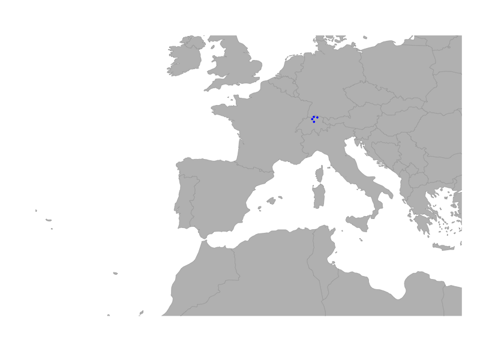

```{r setup, include=FALSE}
knitr::opts_chunk$set(echo = TRUE)
knitr::opts_chunk$set(warning = FALSE, message = FALSE) 

```

# Creating a custom topographic grid

In this script we walk through the steps to obtain a topographic grid of central africa us. We first use the 'makeNewGraph' function to create a new gGraph object, then we use the 'assignRasterPoints' function to add elevation as well as habitat data to the graph, and finally we visualize the resulting topographic grid by assigning different habitat types based on the habitat and elevation ranges within a cell using the 'collapseRasterAttributes' function.

```{r loading libraries, include=FALSE}
library(geoGraph) #graph analysis
library(elevatr) #for elevation data
library(sf)
library(terra)
library(tidyverse)
```

### Getting the elevation data

In the first step, we define the area of interest using a bounding box and then use the `get_elev_raster` function from the `elevatr` package to retrieve topographical and bathymetry data for that area. The resulting data is then converted to a `SpatRaster` object using the `rast` function from the `terra` package.

```{r getting topographic data}
# define the area of interest (Europe)
area_of_interest <- st_as_sfc(
  st_bbox(c(
    xmin = -25,   
    xmax = 25,    
    ymin = 34,    
    ymax = 50     
  ), crs = 4326)
)

aoi_bound <- st_sf(geometry = area_of_interest)

elevation_data <- elevatr::get_elev_raster(
  locations = aoi_bound,
  z = 4,
  clip = "locations"
)

# convert to SpatRaster
spatr <- rast(elevation_data)   
plot(spatr)
```

#### Makeing a land mask

Using this `SpatRaster` we can create a land mask by using the `make_land_mask` function from the `pastclim` package. This function identifies land and ocean areas based on the simple logic of moving the ocean up and down given the current relief profile for the time of choice. In this case, we use the present time (0 years before present) to create a land mask for our area of interest.

```{r making land mask}
# make land mask (everything above 0m is land)
land_mask <- pastclim::make_land_mask(spatr, time_bp = 0) #using the present time
land_mask[is.na(land_mask)] <- 0 # set NAs to 0 (ocean)
plot(land_mask)
```

### Creating the graph object

Next, we create a new graph object using the `createNewGraph` function from the `geoGraph` package. We specify the geographic bounding box for for our area of interest and set the spacing between nodes in the graph. The resulting graph object represents a grid over the area of interest with cells of the about 60km spacing, and we can visualize the graph structure using the `plot` and `plotEdges` functions.

```{r creating graph object}
ggraph <- geoGraph::createNewGraph(geo_box = aoi_bound, spacing = 30)
plot(ggraph, reset = TRUE)
plotEdges(ggraph)
```

### Addiing the land/water mask to the graph

We then use the `assignRasterPoints` function to add the land/water mask to the graph. This function takes the graph object and the land mask raster as inputs and assigns the land/water values to the corresponding cells in the graph. In this example we classify each cell with land points in it as land by defining the 'fun' parameter in collapseNodeAttribute as 'max', which means that if there is at least one land point in the cell, the cell will be classified as land. We can then visualize the resulting graph with the land/water mask by plotting the graph and coloring the nodes based on the land/water values.

```{r}
water_graph <- geoGraph::assignRasterPoints(
  graph = ggraph,
  raster = land_mask,
  layer_name = "water"
)

# now we collapse the water attribute to get a land/sea classification for each node
water_land_graph <- geoGraph::collapseNodeAttribute(
  graph = water_graph,
  attribute = "water",
  fun = max,
  na.rm = TRUE
)

# add this to the habitat attribute
habitat <- factor(water_land_graph@nodes.attr$water,
                  levels = c(0, 1),
                  labels = c("sea", "land"))

# reclassify the nodes in the gGraph object accordingly in the metadata
water_land_graph@nodes.attr$habitat <- habitat

colors <- data.frame(habitat =  c("sea", "land"),
                     cost = c("blue", "green"))

# change colors associated with the land meta info
water_land_graph@meta$colors <- colors

plot(water_land_graph, reset = TRUE)
```

### Assigning elevation data to graph nodes

In the next step we can then use the `assignRasterPoints` function again to add elevation data to the nodes of the graph. In this case we need to chose how to incorporate the elevation data into the graph, since each node will have multiple raster points associated with it. So before using the collapseNodeAttribute function to get a single elevation value for each node, we can first have a look at the standard deviation of the elevation values for each node, which gives us an idea of the variability of elevation within each cell. This can be useful for identifying rugged areas, which typically have high variability in elevation and a higher cost of traveling through associated. For this we set the 'fun' parameter in the collapseNodeAttribute function to 'sd', which calculates the standard deviation of the elevation values for each node. We can then visualize the distribution of the standard deviation of elevation values for land cells by plotting a density plot.

```{r assigning elevation data}
elevation_graph <- geoGraph::assignRasterPoints(
  graph = water_land_graph,
  raster = spatr,
  layer_name = "elevation"
)

# now we collapse the elevation attribute to get the sd of the elevation for each node
elevation_graph <- geoGraph::collapseNodeAttribute(
  graph = elevation_graph,
  attribute = "elevation",
  fun = sd,
  na.rm = TRUE
)

# have a look at the distribution of sd_elevation values for land cells
sd_ele <- elevation_graph@nodes.attr %>%
  mutate(
    elevation = ifelse(habitat == "land", elevation, NA_real_)
  ) %>%
  pull(elevation)

# plot the density
plot(density(log(sd_ele), na.rm = TRUE), main = "Density of SD Elevation for Land Cells",
     xlab = "SD Elevation (m)", ylab = "Density")

```

### Reclassify the nodes into 'rugged' and 'very rugged'

Looking at the distribution of the standard deviation of elevation values for land cells, we can see that there are some cells with very high variability in elevation, which likely correspond to mountainous areas. We can then reclassify the nodes into 'rugged' and 'very rugged' based on an elevation threshold. Here we pick arbitrary thresholds for the standard deviation of elevation values to classify cells as 'rugged' and 'very rugged'. Cells with a standard deviation of elevation greater than 100 are classified as 'rugged', while those with a standard deviation greater than 150 are classified as 'very rugged'. We can then update the habitat attribute in the graph accordingly and visualize the resulting graph with the new habitat classifications.

```{r reclassifying nodes}
# set a threshold for rugged cells
rugged_threshold <- 150
very_rugged_threshold <- 400

## now we identify rugged and very rugged cells as those with sd_elevation > threshold
habitat_new <- dplyr::case_when(
  is.na(sd_ele) ~ "sea",
  sd_ele > very_rugged_threshold ~ "very_rugged",
  sd_ele > rugged_threshold ~ "rugged",
  TRUE ~ "land"
)

# update the habitat attribute in the graph
# reclassify the nodes in the gGraph object accordingly in the metadata
elevation_graph@nodes.attr$habitat <- habitat_new


colors <- data.frame(habitat =  c("sea", "land", "rugged", "very_rugged"),
                     cost = c("blue", "green", "orange", "brown"))

# change colors associated with the land meta info
elevation_graph@meta$colors <- colors

plot(elevation_graph, reset = TRUE)
```

### Adding coastal cells

Now in a last step we can add a 'coast' category to the habitat classification for cells that are adjacent to any land based cells. This is done by checking the neighbors of each sea cell and reclassifying those that have at least one land or mountain neighbor as 'coast'. We can then visualize the resulting graph with the new habitat classifications, including the coastal cells.

```{r adding coastal cells}
# get the neighbor list from the graph
neigh_list <- elevation_graph@graph@edgeL
node_attr <- elevation_graph@nodes.attr

# get all nodes adjacent to land or mountain cells and reclassify them as "coast"
for (i_node in 1:nrow(node_attr)) {
  if (node_attr$habitat[i_node] == "sea") { 
    neighbour_indices <- neigh_list[[i_node]]$edges  # check structure!
    neighbour_land_values <- node_attr$habitat[neighbour_indices]
    if (any(neighbour_land_values %in% c("land", "rugged", "very_rugged"))) {
      # at least one land or mountain neighbour
      node_attr$habitat[i_node] <- "coast"
    }
  }
}

new_attribute <- node_attr

#create the full_graph 
full_graph <- elevation_graph

# set the new node attributes
full_graph@nodes.attr <- new_attribute


colors <- data.frame(habitat =  c("sea", "land", "rugged", "very_rugged", "coast"),
                     cost = c("blue", "green", "orange", "brown", "lightblue"))

# change the costs and colors associated with the land meta info
full_graph@meta$colors <- colors
plot(full_graph, reset = TRUE)
```

### Setting costs for the different habitat types

Finally, we can set the costs for moving through different habitat types based on their classification. Note that the cost here is arbitrary and can be adjusted based on the specific context of the analysis and the species or features being studied. Costs are inversely related to the ease of movement through a cell, so higher costs indicate more difficult terrain. For example, we can assign a cost of 10 for moving through sea cells, a cost of 1 for moving through land cells, a cost of 3 for moving through rugged cells, a cost of 10 for moving through very rugged cells, and a cost of 1 for moving through coastal cells. We can then use the `setCosts` function to assign these costs to the graph based on the habitat classification.

```{r setting costs}

# create a dataframe with the costs and colors associated with each habitat type
costs <- data.frame(
  habitat = factor(c("sea", "land", "rugged", "very_rugged", "coast"),
                   c("sea", "land", "rugged", "very_rugged", "coast")),
  cost = c(10, 1, 3, 10, 1)
)

full_graph@meta$costs <- costs
full_graph <- setCosts(full_graph, method = "mean", attr.name = "habitat")
plot(full_graph, reset = TRUE)
plotEdges(full_graph)
```

### Visualizing connectivity in the topographic grid

Now that we have our topographic grid with different habitat classifications and associated costs, we can use the `nodeBuffer` function to visualize connectivity in the grid. This function simulates the spread of a species or feature from a specified origin point across the graph, taking into account the costs of moving through different habitat types. In this example, we set the origin to be Zurich (with coordinates x = 8.5417, y = 47.3769) and specify a maximum distance of 50 units for the diffusion process. We then create a color matrix to visualize the diffusion area, where cells that are part of the diffusion area are colored blue and all other cells are transparent. Doing this for each step allows us then to create an animation of the diffusion process across the topographic grid, showing how the species or feature spreads over time while navigating through different habitat types and their associated costs.

```{r}
# we set the origin to be rome
origin <- list(x = 8.5417, y = 47.3769)

graph_dif <- nodeBuffer(
  graph = full_graph,
  origin = origin,
  max_distance = 15
)

temp <- c(TRUE, FALSE)

# initialize all as transparent
colMat <- data.frame(
  diffusion_area = temp,
  color = "transparent",
  stringsAsFactors = FALSE
)

# set color for diffusion area
colMat$color[colMat$diffusion_area == TRUE] <- "blue"
```


